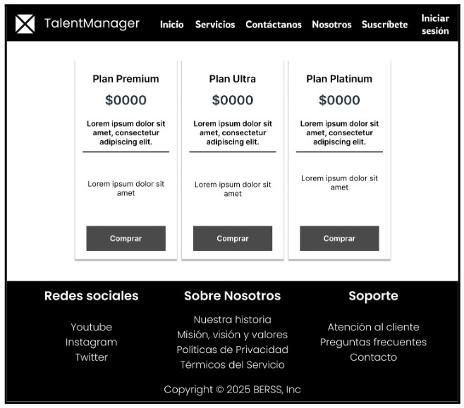
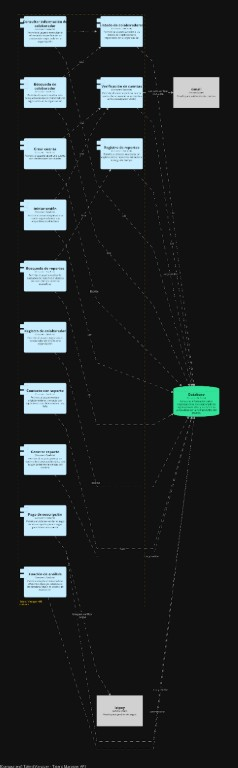

   
 

 
 
<strong>Universidad Peruana de Ciencias Aplicadas</strong>

 
 
<strong>Ingeniería de Software</strong> 
 Desarrollo de Aplicaciones Open Source  
 <strong>Profesor:</strong> Efraín Ricardo Bautista Ubillús

 
 <h2 align="center">INFORME</h2>
 
 <h3 align="center">Startup: BERSS</h3>
 
<strong>Producto: TalentManager</strong>

 
<strong>Ciclo: 2025-10</strong>

 
 <h3 align="center">Team Members:</h3>
 
 

 
 | **Member**                           | **Code**     |
 |--------------------------------------|--------------|
 |Gabriel Sebastían Borja Molina   |  U202310308  |
 |Santiago Iván Cárdenas Concha    |  U202311207  |
 |Luis Piero Rodríguez Rodríguez   |  U202311334  |
 |Luis Gustavo Román Pajuelo       |  U202123373  |
 |Santiago Manuel Suárez Romero    |  U202311532  |
 
 
 

 
 
<strong>Junio, 2025</strong>

 
**REGISTRO DE VERSIONES DEL INFORME**

| Versión  | Fecha  | Autores | Descripción de Modificación      |
| :---: | :---: | ----- | ----- |
| 1 (TB1) | 27/04/2025 | Gabriel Sebastián Borja Molina, Santiago Iván Cárdenas Concha, Luis Piero Rodríguez Rodríguez, Luis Gustavo Román Pajuelo, Santiago Manuel Suárez Romero | Desarrollo de capitulos 1, 2, 3, 4 y 5 |
| 2 (TP1) | 16/05/2025 | Gabriel Sebastián Borja Molina, Santiago Iván Cárdenas Concha, Luis Piero Rodríguez Rodríguez, Luis Gustavo Román Pajuelo, Santiago Manuel Suárez Romero | Desarrollo de frontend de la aplicación y segundo sprint  |
| 3 (TB2) | 22/06/2025 | Gabriel Sebastián Borja Molina, Santiago Iván Cárdenas Concha, Luis Piero Rodríguez Rodríguez, Luis Gustavo Román Pajuelo, Santiago Manuel Suárez Romero | Desarrollo de backend de la aplicación y tercer sprint  |
| 4 (TF1) |  |  |  |

**PROJECT REPORT COLLABORATION INSIGHTS**

Link del repositorio: https://github.com/TalentManager-BERSS/ProyectReport-TalentManager

Insights (todos participaron): 

  

**CONTENT** 

[Capítulo I: Introducción	](#capítulo-i:-introducción)

[1.1.  Startup Profile](#1.1.-startup-profile)

[1.1.1. Descripción de la startup	](#1.1.1.-descripción-de-la-startup)

[1.1.2. Perfiles de integrantes de grupo	](#heading=)

[1.2 Solution Profile](#1.2-solution-profile)

[1.2.1. Antecedentes y problemática	](#1.2.1.-antecedentes-y-problemática)

[5 “W” s	](#5-“w”-s)

[What	](#what)

[When	](#when)

[Where	](#where)

[Who	](#who)

[Why	](#why)

[2 “H” s	](#2-“h”-s)

[How	](#how)

[How much	](#how-much)

[1.2.2. Lean UX Process	](#1.2.2.-lean-ux-process)

[1.2.2.1. Lean UX Problem Statements	](#1.2.2.1.-lean-ux-problem-statements)

[1.2.2.2. Lean UX Assumptions	](#1.2.2.2.-lean-ux-assumptions)

[1.2.2.2.1 Resultados del usuario	](#1.2.2.2.1-resultados-del-usuario)

[1.2.2.2.2 Features	](#1.2.2.2.2-features)

[1.2.2.2.3 Business Outcomes	](#1.2.2.2.3-business-outcomes)

[1.2.2.2.4 User Benefits	](#1.2.2.2.4-user-benefits)

[1.2.2.2.5 ¿Quién es el usuario?	](#1.2.2.2.5-¿quién-es-el-usuario?)

[1.2.2.2.6 ¿Dónde encaja nuestro producto en su trabajo o vida?	](#1.2.2.2.6-¿dónde-encaja-nuestro-producto-en-su-trabajo-o-vida?)

[1.2.2.2.7 ¿Qué problemas tiene nuestro producto y cómo se pueden resolver?	](#1.2.2.2.7-¿qué-problemas-tiene-nuestro-producto-y-cómo-se-pueden-resolver?)

[1.2.2.2.8 ¿Cuándo y cómo es usado nuestro producto?	](#1.2.2.2.8-¿cuándo-y-cómo-es-usado-nuestro-producto?)

[1.2.2.2.9 ¿Qué características son importantes?	](#1.2.2.2.9-¿qué-características-son-importantes?)

[1.2.2.2.10 ¿Cómo debe verse nuestro producto y cómo debe comportarse?	](#1.2.2.2.10-¿cómo-debe-verse-nuestro-producto-y-cómo-debe-comportarse?)

[1.2.2.3. Lean UX Hypothesis Statements	](#1.2.2.3.-lean-ux-hypothesis-statements)

[1.2.2.4. Lean UX Canvas	](#1.2.2.4.-lean-ux-canvas)

[1.3 Segmentos objetivo](#1.3-segmentos-objetivo)

[Capítulo II: Requirements Elicitation & Analysis](#capítulo-ii:-requirements-elicitation-&-analysis)

[2.1 Competidores](#2.1-competidores)

[2.1.1 Análisis competitivo	](#2.1.1-análisis-competitivo)

[2.1.2 Estrategias y tácticas frente a competidores	](#2.1.2-estrategias-y-tácticas-frente-a-competidores)

[2.2 Entrevistas](#2.2-entrevistas)

[2.2.1 Diseño de entrevistas	](#2.2.1-diseño-de-entrevistas)

[2.2.2 Registro de entrevistas	](#2.2.2-registro-de-entrevistas)

[2.2.3 Análisis de entrevistas	](#2.2.3-análisis-de-entrevistas)

[2.3 Needfinding](#2.3-needfinding)

[2.3.1 User Personas	](#2.3.1-user-personas)

[2.3.2 User Task Matrix	](#2.3.2-user-task-matrix)

[2.3.3 User Journey Mapping	](#2.3.3-user-journey-mapping)

[2.3.4 Empathy Mapping	](#2.3.4-empathy-mapping)

[2.3.5 As-is Scenario Mapping	](#2.3.5-as-is-scenario-mapping)

[2.4 Ubiquitous Language](#2.4-ubiquitous-language)

[Capítulo III: Requirements Specification](#capítulo-iii:-requirements-specification)

[3.1. To-Be Scenario Mapping	](#3.1.-to-be-scenario-mapping)

[3.2. User Stories	](#3.2.-user-stories)

[3.3. Impact Mapping	](#3.3.-impact-mapping)

[3.4. Product Backlog	](#3.4.-product-backlog)

[Capítulo IV: Product Design](#capítulo-iv:-product-design)

[4.1. Style Guidelines.	](#4.1.-style-guidelines.)

[4.1.1. General Style Guidelines.	](#4.1.1.-general-style-guidelines.)

[4.1.1.1 Tipografía	](#4.1.1.1-tipografía)

[4.1.1.2 Colores	](#4.1.1.2-colores)

[4.1.1.3 Espaciado	](#4.1.1.3-espaciado)

[4.1.1.4 Iconografía	](#4.1.1.4-iconografía)

[4.1.1.5 Tono de Comunicación y Lenguaje Aplicado	](#4.1.1.5-tono-de-comunicación-y-lenguaje-aplicado)

[4.1.2. Web Style Guidelines.	](#4.1.2.-web-style-guidelines.)

[4.2. Information Architecture.](#4.2.-information-architecture.)

[4.2.1. Organization Systems.	](#4.2.1.-organization-systems.)

[4.2.2. Labeling Systems.	](#4.2.2.-labeling-systems.)

[4.2.3. SEO Tags and Meta Tags	](#4.2.3.-seo-tags-and-meta-tags)

[4.2.4. Searching Systems.	](#4.2.4.-searching-systems.)

[4.2.5. Navigation Systems.	](#4.2.5.-navigation-systems.)

[4.3. Landing Page UI Design.](#4.3.-landing-page-ui-design.)

[4.3.1. Landing Page Wireframe.	](#4.3.1.-landing-page-wireframe.)

[4.3.2. Landing Page Mock-up.	](#4.3.2.-landing-page-mock-up.)

[4.4. Web Applications UX/UI Design.](#4.4.-web-applications-ux/ui-design.)

[4.4.1. Web Applications Wireframes.	](#4.4.1.-web-applications-wireframes.)

[4.4.2. Web Applications Wireflow Diagrams.	](#4.4.2.-web-applications-wireflow-diagrams.)

[4.4.2. Web Applications Mock-ups.	](#4.4.2.-web-applications-mock-ups.)

[4.4.3. Web Applications User Flow Diagrams.	](#4.4.3.-web-applications-user-flow-diagrams.)

[4.5. Web Applications Prototyping.](#4.5.-web-applications-prototyping.)

[4.6. Domain-Driven Software Architecture.](#4.6.-domain-driven-software-architecture.)

[4.6.1. Software Architecture Context Diagram.	](#4.6.1.-software-architecture-context-diagram.)

[4.6.2. Software Architecture Container Diagrams.	](#4.6.2.-software-architecture-container-diagrams.)

[4.6.3. Software Architecture Components Diagrams.	](#4.6.3.-software-architecture-components-diagrams.)

[4.7.Software Object-Oriented Design.](#4.7.software-object-oriented-design.)

[4.7.1. Class Diagrams.	](#4.7.1.-class-diagrams.)

[4.7.2. Class Dictionary.	](#4.7.2.-class-dictionary.)

[4.8. Database Design.](#4.8.-database-design.)

[4.8.1. Database Diagram.	](#4.8.1.-database-diagram.)

[Capítulo V: Product Implementation, Validation & Deployment](#capítulo-v:-product-implementation,-validation-&-deployment)

[5.1. Software Configuration Management.](#5.1.-software-configuration-management.)

[5.1.1. Software Development Environment Configuration.](#5.1.1.-software-development-environment-configuration.)

[5.1.2. Source Code Management.	](#5.1.2.-source-code-management.)

[5.1.3. Source Code Style Guide & Conventions.	](#5.1.3.-source-code-style-guide-&-conventions.)

[5.1.4. Software Deployment Configuration.	](#5.1.4.-software-deployment-configuration.)

[5.2. Landing Page, Services & Applications Implementation.](#5.2.-landing-page,-services-&-applications-implementation.)

[5.2.1. Sprint 1	](#5.2.1.-sprint-1)

[5.2.1.1. Sprint Planning 1\.	](#5.2.1.1.-sprint-planning-1.)

[5.2.1.2. Aspect Leaders and Collaborators.	](#5.2.1.2.-aspect-leaders-and-collaborators.)

[5.2.1.3. Sprint Backlog 1\.	](#5.2.1.3.-sprint-backlog-1.)

[5.2.1.4. Development Evidence for Sprint Review.	](#5.2.1.4.-development-evidence-for-sprint-review.)

[5.2.1.5. Execution Evidence for Sprint Review.	](#5.2.1.5.-execution-evidence-for-sprint-review.)

[5.2.1.6. Services Documentation Evidence for Sprint Review.	](#5.2.1.6.-services-documentation-evidence-for-sprint-review.)

[5.2.1.7. Software Deployment Evidence for Sprint Review.	](#5.2.1.7.-software-deployment-evidence-for-sprint-review.)

[5.2.1.8. Team Collaboration Insights during Sprint.	](#5.2.1.8.-team-collaboration-insights-during-sprint.)

[5.2.2. Sprint 1	](#5.2.2.-sprint-1)

[5.2.2.1. Sprint Planning 1\.	](#5.2.2.1.-sprint-planning-1.)

[5.2.2.2. Aspect Leaders and Collaborators.	](#5.2.2.2.-aspect-leaders-and-collaborators.)

[5.2.2.3. Sprint Backlog 1\.	](#5.2.2.3.-sprint-backlog-1.)

[5.2.2.4. Development Evidence for Sprint Review.	](#5.2.2.4.-development-evidence-for-sprint-review.)

[5.2.2.5. Execution Evidence for Sprint Review.	](#5.2.2.5.-execution-evidence-for-sprint-review.)

[5.2.2.6. Services Documentation Evidence for Sprint Review.	](#5.2.2.6.-services-documentation-evidence-for-sprint-review.)

[5.2.2.7. Software Deployment Evidence for Sprint Review.	](#5.2.2.7.-software-deployment-evidence-for-sprint-review.)

[5.2.2.8. Team Collaboration Insights during Sprint.	](#5.2.2.8.-team-collaboration-insights-during-sprint.)

[5.2.3. Sprint 3	](#5.2.3.-sprint-3)

[5.2.3.1. Sprint Planning ](#5.2.3.1.-sprint-planning)

[5.2.3.2. Aspect Leaders and Collaborators.	](#5.2.3.2.-aspect-leaders-and-collaborators)

[5.2.3.3. Sprint Backlog 3\.	](#5.2.3.3.-sprint-backlog-3)

[5.2.3.4. Development Evidence for Sprint Review.	](#5.2.3.4.-development-evidence-for-sprint-review)

[5.2.3.5. Execution Evidence for Sprint Review.	](#5.2.3.5.-execution-evidence-for-sprint-review)

[5.2.3.6. Services Documentation Evidence for Sprint Review.	](#5.2.3.6.-services-documentation-evidence-for-sprint-review)

[5.2.3.7. Software Deployment Evidence for Sprint Review.	](#5.2.3.7.-software-deployment-evidence-for-sprint-review)

[5.2.3.8. Team Collaboration Insights during Sprint.	](#5.2.3.8.-team-collaboration-insights-during-sprint)

[5.3. Validation Interviews](#5.3.-validation-interviews)

[5.3.1. Diseño de Entrevistas](#5.3.1.-diseño-de-entrevistas)

[5.3.2. Registro de Entrevistas](#5.3.2.-registro-de-entrevistas)

[5.3.3. Evaluaciones según heurísticas](#5.3.3.-evaluaciones-según-heurísticas)

[5.4. Video About-the-Product](#5.4.-video-about-the-product)

[Conclusiones y recomendaciones](#conclusiones-y-recomendaciones:)

# STUDENT OUTCOME

| Criterio Específico | Acciones realizadas | Conclusiones |
| ----- | ----- | ----- |
| Comunica en forma escrita ideas y/o resultados con objetividad a público de diferentes especialidades y niveles jerarquicos, en el marco del desarrollo de un proyecto en ingeniería | Cárdenas Concha, Santiago Iván Suárez Romero, Santiago Suárez Luis Gustavo Roman Pajuelo  Gabriel Sebastian Borja Molino Roman Pajuelo, Luis Gustavo  Avance TB1 | Se completó el trabajo cumpliendo con los aspectos necesarios, permitiendo así entregar un resultado adecuado. El documento redactado sirve como referencia para quienes deseen conocer el proceso seguido en la planificación, desarrollo y puesta en producción del proyecto. |
| Comunica oralmente sus ideas y/o resultados con objetividad a público de diferentes especialidades y niveles jerárquicos, en el marco del desarrollo de un proyecto en ingeniería. | Cárdenas Concha, Santiago Iván Suárez Romero, Santiago Suárez Luis Gustavo Roman Pajuelo  Gabriel Sebastian Borja Molino Roman Pajuelo, Luis Gustavo  Avance TB1 | Como equipo logramos implementar formas de comunicación efectivas que nos permitieron presentar un trabajo integral, a pesar del reto que implicaron los plazos ajustados para su entrega. Asimismo, se compartieron los resultados obtenidos mediante entrevistas, donde se evidenció una respuesta positiva hacia el programa. |
| Comunica en forma escrita ideas y/o resultados con objetividad a público de diferentes especialidades y niveles jerarquicos, en el marco del desarrollo de un proyecto en ingeniería | Cárdenas Concha, Santiago Iván Suárez Romero, Santiago Suárez Luis Gustavo Roman Pajuelo  Gabriel Sebastian Borja Molino Roman Pajuelo, Luis Gustavo  Avance TP | Se completó el trabajo cumpliendo con los aspectos necesarios, permitiendo así entregar un resultado adecuado. El documento redactado sirve como referencia para quienes deseen conocer el proceso seguido en la planificación, desarrollo y puesta en producción del proyecto. |
| Comunica oralmente sus ideas y/o resultados con objetividad a público de diferentes especialidades y niveles jerárquicos, en el marco del desarrollo de un proyecto en ingeniería. | Cárdenas Concha, Santiago Iván Suárez Romero, Santiago Suárez Luis Gustavo Roman Pajuelo  Gabriel Sebastian Borja Molino Roman Pajuelo, Luis Gustavo  Avance TP | Como equipo logramos implementar formas de comunicación efectivas que nos permitieron presentar un trabajo integral, a pesar del reto que implicaron los plazos ajustados para su entrega. Asimismo, se compartieron los resultados obtenidos mediante entrevistas, donde se evidenció una respuesta positiva hacia el programa. |
| Comunica en forma escrita ideas y/o resultados con objetividad a público de diferentes especialidades y niveles jerarquicos, en el marco del desarrollo de un proyecto en ingeniería | Cárdenas Concha, Santiago Iván Suárez Romero, Santiago Suárez Luis Gustavo Roman Pajuelo  Gabriel Sebastian Borja Molino Roman Pajuelo, Luis Gustavo  Avance TB2 | Se completó el trabajo cumpliendo con los aspectos necesarios, permitiendo así entregar un resultado adecuado. El documento redactado sirve como referencia para quienes deseen conocer el proceso seguido en la planificación, desarrollo y puesta en producción del proyecto. |
| Comunica oralmente sus ideas y/o resultados con objetividad a público de diferentes especialidades y niveles jerárquicos, en el marco del desarrollo de un proyecto en ingeniería. | Cárdenas Concha, Santiago Iván Suárez Romero, Santiago Suárez Luis Gustavo Roman Pajuelo  Gabriel Sebastian Borja Molino Roman Pajuelo, Luis Gustavo  Avance TB2 | Como equipo logramos implementar formas de comunicación efectivas que nos permitieron presentar un trabajo integral, a pesar del reto que implicaron los plazos ajustados para su entrega. Asimismo, se compartieron los resultados obtenidos mediante entrevistas, donde se evidenció una respuesta positiva hacia el programa. |
# 

# **Capítulo I: Introducción** 

## 1.1. 	Startup Profile

### **1.1.1. Descripción de la startup** 

BERSS es una startup conformada por estudiantes de la Universidad Peruana de Ciencias Aplicadas (UPC), unidos por la convicción de que la tecnología puede transformar positivamente la gestión del talento humano en las organizaciones. Nuestro equipo multidisciplinario integra habilidades en desarrollo de software, diseño de experiencia de usuario, análisis de datos y gestión empresarial, con el objetivo común de crear soluciones digitales que impulsen el desempeño y el crecimiento profesional de las personas.

Motivados por el deseo de generar impacto real en el entorno laboral, creemos que el talento es el recurso más valioso de una organización, y que su desarrollo debe estar acompañado por herramientas accesibles, intuitivas y centradas en el usuario. Desde esta visión, desarrollamos productos tecnológicos orientados a mejorar los procesos de evaluación, seguimiento y gestión del talento dentro de las empresas.

En BERSS, trabajamos de manera colaborativa y con propósito, diseñando soluciones que simplifican la toma de decisiones, fortalecen la cultura organizacional y promueven una gestión más humana, informada y eficiente del recurso humano.

**Misión:** Desarrollar soluciones digitales accesibles e innovadoras que mejoren la gestión del talento humano, integrando tecnología, empatía y conocimiento para potenciar el crecimiento de las personas y las organizaciones.

**Visión:** Ser una startup referente en Latinoamérica en el desarrollo de soluciones tecnológicas orientadas al talento humano. Aspiramos a ser reconocidos por nuestro compromiso con el desarrollo profesional, la inclusión digital y la creación de herramientas que generen valor real en las empresas y sus equipos.

### **1.1.2. Perfiles de integrantes de grupo**

| Foto                          | Información                                                                 |
|-------------------------------|------------------------------------------------------------------------------|
|  | **Nombre:** Gabriel Sebastián Borja Molina 
**Código de estudiante:** U202310308  
**Carrera:** Ingeniería de Software  
**Descripción:**  
Soy Gabriel Borja, tengo 19 años y soy estudiante de la carrera de Ingeniería de Software de la UPC. Soy responsable, cordial y tengo facilidad para aprender sobre temas nuevos. Me comprometo a brindar mi apoyo y responsabilidad para ayudar al equipo para culminar exitosamente el curso. |
|  | **Nombre:** Santiago Iván Cárdenas Concha  
**Código de estudiante:** U202311207  
**Carrera:** Ingeniería de Software
**Descripción:**
Soy responsable, creativo y siempre trato de apoyar al equipo en todo hasta el final.
|  | **Nombre:** Santiago Manuel Suárez Romero 
**Código de estudiante:** U202311532  
**Carrera:** Ingenieria de Software  
**Descripción:**  
Soy una persona amigable, trabajadora y creativa, cuando trabajo siempre trato de dar lo mejor de mi.
|  | **Nombre:** Luis Piero Rodríguez Rodríguez 
**Código de estudiante:** U202311334
**Carrera:** Ingeniería de Software  
**Descripción:**  
Soy una persona optimista, dedicada y que trata de mejorar |
|  | **Nombre:** Luis Gustavo Román Pajuelo
**Código de estudiante:** U202123373 
**Carrera:** Ingeniería de Software  
**Descripción:**
Soy responsable y siempre busco cumplir mis objetivos.

## 1.2 Solution Profile 

TalentManager es una aplicación web que permite a las empresas registrar, calificar y dar seguimiento al desempeño de los trabajadores. La plataforma funciona como una base de datos con una interfaz intuitiva, donde los supervisores pueden buscar empleados por nombre y acceder a toda su información, incluyendo datos personales, asistencia, faltas, memorándums y comentarios relevantes. Cada trabajador puede ser evaluado periódicamente mediante un sistema de puntajes y observaciones, lo cual permite generar reportes automáticos que reflejen su rendimiento mensual o acumulado. Estos reportes son útiles para la toma de decisiones por parte de la empresa, ya que ofrecen una visión clara y cuantificable del comportamiento laboral de cada persona. Además, se contempla que algunos criterios puedan tener mayor peso según la prioridad de cada organización, haciendo que la evaluación sea flexible y personalizada. La plataforma está pensada especialmente para empresas medianas o grandes donde el control manual del desempeño se vuelve poco práctico, y se ofrece bajo un modelo de suscripción mensual o anual.

### **1.2.1. Antecedentes y problemática** 

Con el fin de entender con claridad las necesidades de los usuarios, resulta esencial examinar los antecedentes y las problemáticas mediante la técnica de las 5W's & 2H's. Según Alvarez (2020), citado por Lean Construction México, esta herramienta es crucial para definir y estructurar un plan de acción o estrategia. La información presentada a continuación ha sido obtenida aplicando dicha metodología.

Las dos preguntas "H" de la técnica “5W+2H” se refieren a "¿Cómo?" y "¿Cuánto?". La pregunta "¿Cómo?" se enfoca en la manera en que se realizan las acciones, lo cual es crucial para entender y explicar una situación. En el contexto de TalentManager, esta pregunta se utilizará para examinar cómo lograremos que las empresas medianas y grandes adopten nuestra plataforma de seguimiento y evaluación del desempeño laboral. Esto incluye estrategias de comunicación, demostraciones de producto, pruebas gratuitas y soporte técnico que facilite la transición desde métodos manuales a una solución digital. Por otro lado, la pregunta "¿Cuánto?" se centra en cuantificar el problema en cuestión y, a menudo, en evaluar su magnitud. En este caso, los datos recopilados nos permitirán obtener una comprensión más profunda de la situación actual en cuanto al control del desempeño laboral en empresas medianas y grandes, especialmente considerando el tiempo y los recursos que se pierden con métodos tradicionales, y el impacto positivo que puede tener la automatización y digitalización del proceso mediante TalentManager.

| 5 “W” s |  |  |
| :---- | :---- | :---- |
| **What** ¿Qué? | ¿Cuál es el problema? | ​TalentManager surge como respuesta a una problemática significativa en el ámbito empresarial: la carencia de herramientas eficientes para registrar, calificar y dar seguimiento al desempeño de los trabajadores, especialmente en empresas medianas y grandes. El informe "Benchmarking de Gestión de Recursos Humanos 2021" de PwC Perú revela que el 46.3% de las empresas encuestadas implementaron cambios en sus procesos de gestión de desempeño a raíz de la pandemia de COVID-19 (PwC, 2021). Este dato subraya la necesidad de adaptar y mejorar las metodologías tradicionales de evaluación para enfrentar los desafíos impuestos por la nueva normalidad, donde el trabajo remoto y las dinámicas laborales han evolucionado significativamente. La falta de sistemas adecuados puede conducir a una gestión ineficaz del talento humano, afectando negativamente la productividad y el clima laboral.​ Además, según un estudio publicado por la Agencia Andina, el 62% de los líderes de recursos humanos en Perú consideran que el mayor desafío es impulsar la motivación y el compromiso de sus colaboradores (Andina, 2024). Esto resalta la importancia de contar con sistemas efectivos de evaluación y seguimiento del desempeño que permitan identificar áreas de mejora y reconocer los logros del personal, contribuyendo así a un ambiente laboral más motivador y productivo.​ En este contexto, TalentManager se presenta como una solución innovadora que busca transformar la gestión del desempeño laboral. A través de una plataforma web intuitiva y accesible, permite a las empresas centralizar la información de sus empleados, realizar evaluaciones periódicas y generar reportes automáticos que reflejen el rendimiento individual y colectivo. Esto facilita la toma de decisiones informadas y contribuye a la construcción de equipos más comprometidos y eficientes. |
|  | ¿Cuál es la relación con la persona en cuestión? | Para toda empresa interesada en optimizar la gestión del talento humano, TalentManager se presenta como una plataforma atractiva que elimina las barreras en el seguimiento y evaluación del desempeño laboral. Facilita el acceso rápido y organizado a información clave de cada trabajador, fomenta evaluaciones constantes y conecta a los supervisores con herramientas digitales intuitivas. Así, TalentManager se adapta a las necesidades actuales de las empresas medianas y grandes, promoviendo una gestión dinámica, personalizada y eficiente del rendimiento laboral. |
|   **When** ¿Cuándo? | ¿Cuándo ocurre el problema? | El problema surge cuando una empresa desea acceder a información actualizada sobre el desempeño laboral de sus trabajadores y no cuenta con herramientas efectivas para centralizar, organizar y analizar estos datos. Las plataformas tradicionales suelen ser limitadas o poco intuitivas, lo que genera dificultades para realizar evaluaciones oportunas, precisas y objetivas. Además, realizar estos procesos de manera manual puede resultar lento, engorroso e ineficiente, afectando la calidad de las decisiones relacionadas con la gestión del talento humano. TalentManager aborda estas dificultades mediante una plataforma ágil, intuitiva y automatizada, que simplifica la recopilación, el análisis y la presentación clara de información clave sobre el rendimiento laboral. |
|  | ¿Cuándo utiliza el cliente el producto? | La empresa utilizará TalentManager cuando quiera o necesite acceder de manera rápida y segura a información actualizada sobre el desempeño laboral de sus trabajadores. La plataforma permite realizar evaluaciones de manera ágil e intuitiva, brindando acceso instantáneo a datos clave, reportes automáticos y perfiles detallados de cada colaborador, facilitando así una gestión eficiente del talento humano. |
| **Where** ¿Dónde? | ¿Dónde está el cliente cuando usa el producto? | Debido a que TalentManager es una aplicación web, los usuarios pueden acceder fácilmente a la plataforma desde cualquier lugar. Está diseñada para ser accesible desde cualquier dispositivo con conexión a internet, permitiendo así que supervisores y responsables de recursos humanos puedan realizar evaluaciones, consultar información y gestionar el desempeño laboral de sus trabajadores de manera eficiente y sin restricciones geográficas. |
|  | ¿A dónde se dirige? | La empresa se dirige hacia un entorno operativo más eficiente y productivo. Mediante el uso de TalentManager, el objetivo es reducir el tiempo invertido en procesos manuales innecesarios, optimizar la gestión del desempeño laboral y disminuir los costos operativos relacionados con la administración del talento humano. Además, la aplicación facilita a las empresas el cumplimiento de normativas internas o externas en la gestión de recursos humanos, impulsando la adopción de prácticas más transparentes y efectivas, lo cual contribuye a mejorar el clima laboral, la reputación organizacional y el rendimiento general de la empresa. |
|  | ¿Dónde surge el problema? | La problemática surge en las empresas medianas y grandes del Perú. Estos espacios son fundamentales para una gestión eficiente del talento humano, pero, en la actualidad, muchas organizaciones no cuentan con sistemas adecuados para realizar un seguimiento efectivo del desempeño laboral. La falta de herramientas digitales especializadas, la persistencia en métodos manuales poco prácticos y la ausencia de procesos estandarizados de evaluación limitan significativamente la capacidad de las empresas para evaluar y optimizar el rendimiento de sus trabajadores. |
| **Who** ¿Quién? | ¿Quiénes están involucrados? | Los principales involucrados en TalentManager son, en primer lugar, los responsables del área de recursos humanos, quienes buscan una plataforma eficiente y accesible para gestionar de manera estructurada el desempeño de los trabajadores. También están involucrados los supervisores y jefes de área, encargados de realizar evaluaciones, monitorear el progreso del personal y generar reportes que respalden sus decisiones. Estos actores necesitan herramientas que les permitan centralizar datos, automatizar procesos y tomar decisiones informadas. |
|  | ¿A quiénes les sucede el problema? | El problema afecta principalmente a supervisores y responsables operativos, quienes enfrentan dificultades para realizar evaluaciones objetivas y ordenadas debido a la falta de herramientas digitales especializadas. Muchos de ellos siguen utilizando métodos manuales o desorganizados, lo cual genera pérdida de tiempo, errores y falta de claridad en la gestión del rendimiento. Asimismo, gerentes y directivos se ven afectados por la falta de acceso a información clara y confiable sobre el desempeño de sus equipos. Esta situación limita su capacidad para tomar decisiones estratégicas relacionadas con promociones, reestructuraciones o planes de capacitación. En un nivel más amplio, esta carencia afecta la productividad general de la empresa y su capacidad de crecimiento. |
|  | ¿Quién lo utilizará? | TalentManager será utilizado por una variedad de perfiles dentro de las empresas, cada uno con necesidades específicas. Por un lado, los supervisores o jefes de área operativa utilizarán la plataforma como una herramienta sencilla y ágil que les permita registrar de manera continua faltas, observaciones, puntajes y otros aspectos clave del desempeño diario de los trabajadores. Para ellos, la interfaz intuitiva y la automatización de reportes son esenciales, ya que necesitan un sistema que se adapte al ritmo operativo de su trabajo. Por otro lado, los gerentes y tomadores de decisiones estratégicas emplearán TalentManager para obtener una visión global y cuantificable del rendimiento organizacional. Este grupo valorará especialmente la generación de reportes periódicos, la posibilidad de personalizar los criterios de evaluación según las prioridades de la empresa y el acceso rápido a datos que respalden decisiones clave relacionadas con promociones, reestructuraciones o inversión en capacitaciones. |
| **Why** ¿Por qué? | ¿Cuál es la causa del problema? | ​La problemática en la gestión del desempeño laboral en empresas peruanas se debe a diversas causas que afectan tanto la productividad como el ambiente organizacional: Muchas empresas peruanas no cuentan con sistemas adecuados para evaluar el rendimiento de sus empleados, lo cual representa la principal limitación para una gestión eficiente del talento humano. Según un estudio de la Universidad San Ignacio de Loyola, esta ausencia de herramientas dificulta la identificación de áreas de mejora y la implementación de estrategias efectivas para el desarrollo del personal (Loayza & Rosas, 2020). A esto se suma la alta informalidad en el mercado laboral, que afecta al 71.1% de los puestos de trabajo a nivel nacional en 2023\. Esta situación impide la aplicación de procesos estandarizados de evaluación y seguimiento del desempeño, lo que dificulta la mejora continua y limita el crecimiento organizacional (ComexPerú, 2023). Por otro lado, el estrés laboral es un factor que impacta negativamente en la productividad, reduciéndola hasta en un 41%. La falta de mecanismos que permitan detectar y atender las causas de este estrés contribuye a un deterioro en el rendimiento y bienestar de los trabajadores (ESAN, 2020). Estas causas subrayan la urgencia de implementar soluciones como TalentManager, que permiten gestionar el desempeño laboral de forma estructurada, automatizada y personalizada, contribuyendo a mejorar tanto la productividad como el clima laboral dentro de las organizaciones. |

| 2 “H” s |  |  |
| :---- | :---- | :---- |
| **How** ¿Cómo? | ¿En qué condiciones nuestros clientes usan el producto? | Los clientes utilizan TalentManager en condiciones diversas, pero principalmente dentro de su entorno laboral habitual, como oficinas o espacios de trabajo remoto, a través de dispositivos como computadoras, laptops o tablets. Dado que la plataforma es web, los usuarios pueden acceder a ella en cualquier momento del día, ya sea durante reuniones de evaluación, procesos de planificación o revisiones de desempeño. |
|  | ¿Cómo nos conocieron los compradores? | Los clientes conocen TalentManager a través de diversas estrategias de marketing, como la promoción en redes sociales profesionales (LinkedIn, Facebook, etc.), donde se comparte contenido relevante sobre gestión del talento, productividad laboral y casos de éxito de empresas que ya utilizan la plataforma. Además, se realizan campañas publicitarias digitales dirigidas a líderes de recursos humanos y directivos de empresas medianas y grandes. Asimismo, TalentManager puede ser descubierto en espacios vinculados al ámbito empresarial, como ferias de recursos humanos, conferencias, workshops corporativos o mediante alianzas con consultoras especializadas en gestión del talento. |
|  | ¿Cómo prefieren los lectores acceder a nuestro contenido? | Los usuarios de TalentManager prefieren acceder a la plataforma de forma rápida, sencilla y personalizada, a través de la aplicación web disponible desde sus dispositivos móviles o computadoras. Esto les permite consultar información clave sobre los trabajadores, realizar evaluaciones y generar reportes desde cualquier lugar en el que se encuentren. Además, valoran el uso de TalentManager por ofrecer un acceso flexible, dinámico y alineado con sus hábitos digitales, donde la gestión del desempeño laboral se convierte en una experiencia eficiente, intuitiva y libre de complicaciones administrativas. |
|  | ¿Qué llevó a la persona a llegar a esta situación? | ​​La necesidad de implementar TalentManager en una empresa surge de una serie de factores que, acumulados a lo largo del tiempo, han generado deficiencias en la gestión del desempeño laboral. Inicialmente, muchas organizaciones han operado sin sistemas formales de evaluación, lo que dificulta la identificación de áreas de mejora y el reconocimiento de logros. Esta carencia de procesos estructurados impide establecer expectativas claras y ofrecer retroalimentación efectiva a los empleados. Además, la falta de herramientas adecuadas para medir el rendimiento individual y colectivo limita la capacidad de la empresa para tomar decisiones informadas sobre promociones, capacitaciones o ajustes en las responsabilidades laborales. Con el tiempo, estas deficiencias pueden conducir a una disminución en la motivación del personal, afectando negativamente la productividad y el clima organizacional. En este contexto, la adopción de una plataforma como TalentManager se vuelve esencial para centralizar la información del personal, facilitar evaluaciones periódicas y generar reportes automáticos que reflejen el rendimiento, permitiendo así una gestión más eficiente y transparente del talento humano.​ |
| **How much** ¿Cuánto? | Estadísticas que sustentan la problemática | El informe "Benchmarking de Gestión de Recursos Humanos 2021" de PwC Perú indica que el 46.3% de las empresas realizaron cambios en sus procesos de gestión del desempeño a raíz del COVID-19, evidenciando la necesidad de adaptar y mejorar las metodologías tradicionales de evaluación (PwC, 2021).  Según un estudio publicado por la Agencia Andina, el 62% de los líderes de recursos humanos en Perú consideran que el mayor desafío es impulsar la motivación y el compromiso de sus colaboradores, lo que subraya la importancia de contar con sistemas efectivos de evaluación y seguimiento del desempeño (Andina, 2024).  **​**Un artículo en El Peruano destaca que medir el desempeño de los colaboradores genera beneficios tanto para ellos como para las empresas, resaltando la relevancia de implementar sistemas de evaluación efectivos (El Peruano, 2023). |

### **1.2.2. Lean UX Process** 

Lean UX se fundamenta en un enfoque colaborativo orientado a la creación de productos de alta calidad. En lugar de priorizar la perfección del diseño desde el inicio, su énfasis está en el aprendizaje constante, la mejora continua de la experiencia del usuario y en responder adecuadamente a las necesidades del cliente. Esta metodología favorece resultados más efectivos al permitir una comprensión profunda de la visión del negocio, ofreciendo al mismo tiempo flexibilidad para integrar ideas y lograr entregables eficientes (Lean UX y Lean Startup: potencia experiencia y diseño de producto, 2023).

#### **1.2.2.1. Lean UX Problem Statements** 

TalentManager es una plataforma que combina la precisión de una herramienta de recursos humanos con la comodidad y eficiencia de una solución digital accesible desde cualquier lugar. Más que un sistema de evaluación, busca transformar la gestión del talento humano al facilitar el registro, seguimiento y análisis del desempeño laboral, adaptándose a las dinámicas digitales de las organizaciones actuales.

Se ha identificado que la evaluación del desempeño enfrenta múltiples desafíos en el entorno empresarial. El uso de procesos manuales, la falta de estandarización, la ausencia de datos en tiempo real y la dificultad para alinear los criterios de evaluación con los objetivos estratégicos han generado una gestión fragmentada y poco eficiente. Además, muchas empresas se ven obligadas a utilizar múltiples herramientas o planillas dispersas, lo que complica el seguimiento, retrasa la toma de decisiones y reduce la capacidad de análisis del rendimiento.

¿Cómo podemos mejorar la experiencia de evaluación y gestión del talento humano para facilitar el seguimiento del desempeño, optimizar los procesos de toma de decisiones, mejorar la productividad y conectar a los equipos en una plataforma moderna, dinámica y accesible?

#### **1.2.2.2. Lean UX Assumptions** 

##### **1.2.2.2.1 Resultados del usuario**

Los usuarios de TalentManager esperan una solución que les permita gestionar y monitorear el desempeño laboral de manera rápida, clara y accesible. Buscan una plataforma intuitiva que centralice la información de cada trabajador, con reportes automáticos, observaciones detalladas y puntajes de evaluación que faciliten el seguimiento constante. También desean poder personalizar los criterios de evaluación según los objetivos y prioridades de la empresa, recibiendo así datos relevantes y precisos para la toma de decisiones. El resultado esperado es una mayor confianza en los procesos de evaluación, una mejora en la productividad organizacional y una experiencia de usuario que haga más eficiente y transparente la gestión del talento humano.

##### **1.2.2.2.2 Features**

* Fichas completas y personalizadas por trabajador.

* Sistema de evaluación con puntajes y observaciones configurables.

* Reportes automáticos (mensuales, acumulados, individuales y por equipo).

* Búsqueda avanzada por nombre, área o desempeño.

* Panel de análisis con indicadores de rendimiento.

* Acceso multiusuario con permisos diferenciados (supervisores, RR.HH., gerencia).

* Compatibilidad con dispositivos móviles y acceso desde la nube.

##### **1.2.2.2.3 Business Outcomes** 

* Optimizar la gestión del desempeño laboral: El principal objetivo de TalentManager es mejorar la forma en que las empresas medianas y grandes gestionan, evalúan y hacen seguimiento al rendimiento de sus trabajadores. Nuestra plataforma facilita este proceso al centralizar toda la información relevante de cada empleado, permitiendo evaluaciones periódicas con puntajes y observaciones personalizables, reportes automáticos y criterios ajustables según las prioridades organizacionales. De esta manera, contribuimos a una gestión más eficiente, transparente y alineada con los objetivos de la empresa.

* Generación de ingresos: Al operar bajo un modelo de negocio basado en suscripciones mensuales o anuales, TalentManager puede generar ingresos sostenibles que permitan reinvertir en mejoras continuas de la plataforma, incluyendo nuevas funciones, mayor escalabilidad y una mejor experiencia de usuario. Estas mejoras fortalecerán nuestra posición en el mercado, fidelizarán a los clientes actuales y facilitarán la captación de nuevas empresas interesadas en digitalizar su proceso de evaluación del talento humano.

* Diferenciación en el mercado: La propuesta de valor de TalentManager se destaca por ofrecer una plataforma web intuitiva, con funciones únicas como reportes automáticos, criterios de evaluación configurables y un sistema de alertas para seguimientos pendientes. Estas características nos permiten diferenciarnos de otras soluciones más genéricas y posicionarnos como una herramienta especializada para empresas que buscan precisión, eficiencia y flexibilidad en la gestión de su personal.

* Toma de decisiones basada en datos: TalentManager permite a las empresas contar con información confiable y actualizada para tomar decisiones estratégicas sobre promociones, capacitaciones, reestructuraciones o reconocimiento del personal. Al automatizar reportes y facilitar el análisis del rendimiento, se fortalece la capacidad de liderazgo dentro de la organización y se optimiza la planificación del talento humano con base en datos objetivos y medibles.

  ##### **1.2.2.2.4 User Benefits** 

* Acceso rápido y centralizado a toda la información relevante de cada trabajador, permitiendo evaluaciones claras y ordenadas desde una sola plataforma.

* Mejora del proceso de toma de decisiones mediante reportes automáticos que reflejan el rendimiento individual y colectivo de forma visual y comprensible.

* Evaluaciones flexibles y personalizadas según los criterios específicos de cada empresa, adaptándose a distintos cargos, áreas y prioridades organizacionales.

* Experiencia intuitiva y accesible desde cualquier dispositivo, ideal para supervisores y responsables de recursos humanos que necesitan trabajar en distintos entornos.

* Optimización del tiempo invertido en tareas administrativas, al automatizar procesos de registro, seguimiento y generación de reportes.

* Reducción de errores y omisiones en las evaluaciones gracias a un sistema estructurado y fácil de usar.

* Fortalecimiento del liderazgo y la gestión interna al contar con información precisa y actualizada sobre el desempeño de cada miembro del equipo.

* Aumento de la transparencia en la evaluación del personal, generando mayor confianza dentro de la organización y facilitando el reconocimiento del buen rendimiento.

  ##### **1.2.2.2.5 ¿Quién es el usuario?**

El usuario de TalentManager es una persona involucrada en la gestión del talento humano, motivada por el deseo de optimizar el desempeño laboral dentro de su organización. Estos usuarios valoran el acceso rápido a información clave sobre los trabajadores, la posibilidad de realizar evaluaciones personalizadas y la capacidad de tomar decisiones informadas que contribuyan al crecimiento y eficiencia de sus equipos.

##### **1.2.2.2.6 ¿Dónde encaja nuestro producto en su trabajo o vida?** 

TalentManager encaja en la vida de sus usuarios como una herramienta accesible y práctica que facilita la gestión del desempeño laboral desde cualquier lugar y en cualquier momento. Se adapta a sus rutinas diarias dentro del entorno empresarial, ya sea durante reuniones, evaluaciones periódicas o momentos de planificación, permitiéndoles registrar información, consultar reportes y tomar decisiones de forma ágil. De este modo, TalentManager se convierte en un recurso esencial para mantener un control constante y ordenado sobre el rendimiento del equipo.

##### **1.2.2.2.7 ¿Qué problemas tiene nuestro producto y cómo se pueden resolver?**

Un desafío que podría enfrentar TalentManager es la competencia con otras plataformas de gestión de desempeño laboral, especialmente si sus funcionalidades no logran destacar o no se adaptan lo suficiente a las necesidades específicas de cada empresa. Este problema puede resolverse fortaleciendo continuamente la experiencia del usuario, optimizando la interfaz para hacerla más intuitiva, ampliando las opciones de personalización en las evaluaciones y reportes, y reforzando los elementos diferenciadores del producto, como la facilidad de uso, la accesibilidad desde cualquier dispositivo y la capacidad de adaptación a distintos modelos organizacionales.

##### **1.2.2.2.8 ¿Cuándo y cómo es usado nuestro producto?** 

TalentManager es utilizado principalmente durante jornadas laborales, en momentos clave como evaluaciones de desempeño, reuniones de planificación, revisiones mensuales o procesos de toma de decisiones internas. La plataforma permite a los usuarios consultar información por trabajador, área o período, generar reportes automáticos y registrar observaciones personalizadas, facilitando una gestión eficiente del talento humano. Está diseñada para utilizarse en cualquier momento del día, ya sea desde la oficina o en modalidad remota, brindando acceso inmediato a todos los datos necesarios desde cualquier dispositivo con conexión a internet.

##### **1.2.2.2.9 ¿Qué características son importantes?** 

* **Perfiles de desempeño detallados:** Proporcionan una vista completa del historial laboral y evaluaciones de cada trabajador, desglosado por áreas, cargos y periodos, lo que facilita la identificación de fortalezas, debilidades y oportunidades de mejora.

* **Evaluaciones personalizables:** Permiten adaptar los criterios de calificación según los objetivos y estructura de cada empresa, haciendo que el proceso de evaluación sea relevante y alineado con las prioridades organizacionales.

* **Reportes automáticos y visuales:** Generan informes claros, comprensibles y exportables que reflejan el rendimiento individual o colectivo, con comparaciones por periodos y filtros para facilitar el análisis del talento humano.

* **Historial de seguimiento:** Guarda observaciones, calificaciones y acciones pasadas para mantener un registro completo y ordenado del desarrollo de cada trabajador a lo largo del tiempo.

* **Interacción entre áreas:** Facilita la colaboración entre supervisores, RR. HH. y gerencia para compartir información clave, coordinar procesos de evaluación y tomar decisiones basadas en datos.

* **Compatibilidad con dispositivos y sistemas existentes:** Se puede acceder desde distintos dispositivos y navegadores, sin requerir instalaciones complejas, lo que facilita la adopción y el uso diario dentro de la empresa.

* **Privacidad y seguridad de la información:** Protege los datos personales y laborales mediante protocolos de seguridad robustos, cumpliendo con normativas de protección de datos y controlando el acceso por roles de usuario.

##### **1.2.2.2.10 ¿Cómo debe verse nuestro producto y cómo debe comportarse?** {#1.2.2.2.10-¿cómo-debe-verse-nuestro-producto-y-cómo-debe-comportarse?}

* **Interfaz intuitiva, profesional y limpia:** Diseñada con una disposición clara de la información, tipografías legibles y una estética moderna que transmita orden y confianza, facilitando la navegación incluso para usuarios sin experiencia técnica.

* **Rápido y eficiente:** La plataforma debe procesar acciones y cargar datos de forma ágil, permitiendo que los usuarios consulten, editen o evalúen sin demoras, optimizando su tiempo.

* **Estable y confiable:** Debe mantener un alto nivel de disponibilidad, funcionando de manera continua sin interrupciones, ya que los procesos de evaluación y toma de decisiones requieren acceso constante y seguro.

* **Interactiva y funcional:** Brinda retroalimentación útil e inmediata a las acciones del usuario, como confirmaciones de registro o actualizaciones, y facilita el flujo de trabajo con funciones claras y accesibles.

* **Segura y protegida:** Implementa autenticación segura, cifrado de datos sensibles y permisos diferenciados por usuario, asegurando la confidencialidad de la información y previniendo accesos no autorizados.

  #### **1.2.2.3. Lean UX Hypothesis Statements** 

1. Creemos que, al ofrecer perfiles de desempeño detallados, los usuarios tendrán una comprensión más profunda del rendimiento de sus trabajadores y podrán identificar áreas clave para la mejora.  
   Sabremos que esto es cierto cuando el 80% de los supervisores accedan y consulten los perfiles de sus colaboradores al menos una vez por semana, utilizando esta información como base para brindar retroalimentación o tomar decisiones de gestión.

2. Creemos que, al proporcionar evaluaciones personalizables y reportes automáticos, aumentaremos la eficiencia de los procesos de evaluación y reduciremos el tiempo dedicado a tareas administrativas.  
   Sabremos que esto es cierto cuando el 70% de los usuarios reporten una disminución significativa en el tiempo invertido en evaluaciones y generación de informes dentro de los primeros tres meses de uso.

3. Creemos que, al centralizar toda la información del trabajador en una sola plataforma accesible desde cualquier dispositivo, facilitaremos el seguimiento continuo del desempeño laboral y mejoraremos la toma de decisiones.  
   Sabremos que esto es cierto cuando el 60% de los usuarios indiquen que la plataforma les ha permitido tomar decisiones más rápidas y fundamentadas respecto al talento humano.

4. Creemos que, al brindar informes visuales y fáciles de interpretar, mejoraremos la claridad de los datos y aumentaremos el uso estratégico de la información por parte de los responsables de RR. HH.  
   Sabremos que esto es cierto cuando el 50% de los usuarios consulten los reportes gráficos al menos una vez por semana y el 30% los utilicen como base para presentar resultados o proponer cambios a la gerencia.

5. Creemos que, al integrar una experiencia intuitiva, accesible y adaptable, aumentaremos la adopción de la plataforma y facilitaremos su incorporación en la rutina laboral.  
   Sabremos que esto es cierto cuando el 75% de los usuarios utilicen TalentManager de forma continua dentro de las primeras cuatro semanas y manifiesten una mayor satisfacción con la organización del proceso de evaluación.

   #### **1.2.2.4. Lean UX Canvas** 

  

Link del Lean UX Canvas: [https://docs.google.com/presentation/d/1ZuQGHHF-bz5lqgT6a14uyj3nKRctpDh4E8dbKhN6guM/edit?usp=sharing](https://docs.google.com/presentation/d/1ZuQGHHF-bz5lqgT6a14uyj3nKRctpDh4E8dbKhN6guM/edit?usp=sharing)

## 1.3 Segmentos objetivo 

Con el objetivo de alcanzar a futuros clientes de manera eficiente y ofrecer un producto que satisfaga realmente sus necesidades, hemos identificado los siguientes dos segmentos objetivos.

**Segmento objetivo \#1: Supervisores operativos y jefes de área**

Personas encargadas de evaluar directamente el desempeño diario de los trabajadores dentro de áreas operativas, administrativas o técnicas. Buscan herramientas prácticas, rápidas y accesibles para registrar información, realizar observaciones, dar seguimiento al rendimiento del equipo y generar reportes sin recurrir a procesos manuales.

**Aspectos demográficos:**

* Sexo: Masculino y femenino  
* Rango de edad: 20 a 50 años  
* Nivel socioeconómico: Clases B y C (media-alta y media)

**Aspectos geográficos:**

* Nacionalidad: Perú (con posibilidad de expansión regional)  
* Zona geográfica: Urbana

**Aspectos psicográficos:**

* Intereses: Productividad laboral, liderazgo de equipos, mejora del rendimiento y eficiencia de procesos.  
* Estilo de vida: Profesionales activos, con alta carga operativa, que necesitan soluciones ágiles y efectivas para gestionar personal sin descuidar otras tareas de su rol.  
* Actitudes: Valoran la automatización, la facilidad de uso, y buscan herramientas que les ayuden a ser más eficientes. Tienen poca tolerancia a procesos burocráticos o herramientas lentas.

**Segmento objetivo \#2: Gerentes de RR. HH. y directivos estratégicos**

Profesionales encargados de tomar decisiones estratégicas relacionadas con la gestión del talento humano, como promociones, capacitaciones, evaluaciones generales y planificación organizacional. Requieren información clara, cuantificable y confiable sobre el rendimiento del personal para sustentar sus decisiones.

**Aspectos demográficos:**

* Sexo: Masculino y femenino  
* Rango de edad: 30 a 60 años  
* Nivel socioeconómico: Clases A y B (alta y media-alta)

**Aspectos geográficos:**

* Nacionalidad: Perú (con proyección a mercados similares en Latinoamérica)  
* Zona geográfica: Urbana, especialmente en zonas empresariales o industriales

**Aspectos psicográficos:**

* Intereses: Gestión estratégica del talento, transformación digital en RR. HH., eficiencia organizacional, liderazgo empresarial.  
* Estilo de vida: Profesionales orientados a resultados, acostumbrados a usar dashboards, informes ejecutivos y herramientas de análisis. Participan en la toma de decisiones clave para el crecimiento de la empresa.  
* Actitudes: Valoran la precisión, la confiabilidad de los datos, y el acceso rápido a reportes útiles. Buscan soluciones que integren tecnología, análisis y planificación sin añadir complejidad innecesaria.

# **2.1 Competidores** 
En el ámbito de la gestión del desempeño laboral y recursos humanos, existen varias plataformas que ofrecen servicios similares a TalentManager. A continuación, se presentan los principales competidores directos reconocidos:

* **15Five:** Plataforma internacional de gestión del rendimiento y compromiso del empleado, que se destaca por su enfoque en el feedback continuo y el desarrollo personal. 15Five está diseñada para empresas medianas y grandes que desean fortalecer la cultura organizacional a través de herramientas como encuestas de compromiso, establecimiento de objetivos y retroalimentación regular. Aunque es una solución robusta y ampliamente utilizada, sus precios pueden resultar altos para empresas pequeñas o con presupuestos ajustados. Ofrece aplicación web y móvil, además de integraciones con otras plataformas de RR. HH.  
* **BambooHR:** Diseñada especialmente para pequeñas y medianas empresas, BambooHR es una plataforma integral de recursos humanos en la nube que abarca desde la gestión de empleados hasta ausencias, incorporación, evaluaciones y reportes. Su principal fortaleza es la facilidad de uso y el excelente soporte al cliente. A pesar de su buena automatización e interfaz amigable, su capacidad de personalización es más limitada frente a soluciones más complejas. Opera bajo un modelo de suscripción mensual y se distribuye tanto por web como por aplicaciones móviles.  
* **Talentum:** Es un software regional especializado en la gestión humana, con soluciones modulares que abarcan desde la evaluación del desempeño hasta el clima laboral, compensaciones, capacitación, línea de carrera y sucesión. Su enfoque integral lo convierte en una opción atractiva para empresas que buscan centralizar múltiples áreas de RR. HH. Sin embargo, su principal debilidad es la falta de información pública sobre precios y casos de éxito, lo que puede dificultar la comparación con otras alternativas en el mercado. Su distribución se da vía plataforma online accesible desde cualquier dispositivo.

  ### **2.1.1 Análisis competitivo** 

| Competitive Analysis Landscape |  |  |  |  |  |
| ----- | :---- | ----- | ----- | ----- | ----- |
| ¿Por qué realizar este análisis? |  | Llevar a cabo este análisis resulta fundamental, ya que nos brinda una comprensión profunda del panorama competitivo al que se enfrenta nuestra startup. Nos permite identificar tanto los riesgos como las posibilidades de crecimiento dentro del mercado, y reconocer en qué aspectos podemos diferenciarnos de otras propuestas similares. Asimismo, facilita el reconocimiento de nuestras ventajas y limitaciones frente a la competencia, lo que contribuye a una toma de decisiones estratégicas más informada y enfocada. |  |  |  |
| Nombre |  | TalentManager | 15Five | BambooHR | Talentum |
| Logo |  |  |  |  |  |
| Perfil | Overview | Aplicación web que permite a empresas registrar, evaluar y dar seguimiento al desempeño de sus trabajadores con reportes  | Plataforma de Gestión del Rendimiento y Compromiso de Empleados | Plataforma de gestión de recursos humanos en la nube, pensada para pequeñas y medianas empresas.. | Software de gestión humana que ofrece soluciones en la nube para atraer, desarrollar, retener y potenciar el talento humano en las empresas. Sus módulos incluyen gestión del desempeño, diseño organizacional, clima laboral, compensaciones, gestión de competencias, línea de carrera y sucesión, capacitación y desarrollo. ​ |
|  | Ventaja competitiva ¿Qué valor ofrece a los clientes? | Evaluaciones flexibles, reportes automáticos y criterios personalizables | Gestiona el rendimiento de los empleados, centrada en la retroalimentación continua, el establecimiento de objetivos y el compromiso del personal, mejorando la productividad y la cultura organizacional. | Interfaz intuitiva y fácil de usar, especialización en pymes, datos centralizados y seguros y buen soporte al cliente y experiencia del usuario. | Ofrece una plataforma integral que cubre diversas áreas de recursos humanos, permitiendo una gestión centralizada y eficiente del talento. |
| Plan de marketing | Mercado objetivo | Empresas medianas y grandes, especialmente en sectores como retail, logística. | Empresas de tamaño medio a grande. | Empresas pequeñas y medianas  | Empresas de diversos tamaños que buscan modernizar su gestión de recursos humanos mediante soluciones digitales. |
|  | Estrategias de marketing | Ofreceremos pruebas gratis para que las empresas prueben la herramienta sin compromiso y compartiremos opiniones reales de usuarios satisfechos para generar confianza. | Marketing de contenido blogs, webinars, estudios de caso), pruebas gratuitas y testimonios de clientes. | Se emplea estrategias como marketing de contenidos, optimización en buscadores y pruebas gratuitas para captar clientes.   | Ofrecen demostraciones gratuitas de su software, contenido educativo a través de su blog y presencia activa en redes sociales profesionales como LinkedIn. |
| Plan de producto | Productos y servicios | Plataforma web con módulos de evaluación, reportes, seguimiento de asistencia y observaciones. Soporte y capacitación incluidos. | Feedback continuo, evaluaciones de desempeño, establecimiento de objetivos  encuestas de compromiso y herramientas de desarrollo de empleados.  | Se ofrece una plataforma web y app móvil con módulos para gestión de empleados, incorporación, ausencias, evaluaciones, reportes y firma electrónica.  | Software en la nube para gestión de recursos humanos con módulos especializados. |
|  | Precios y costos | Suscripción mensual o anual por número de empleados. | Precios basados en suscripción mensual, con planes que varían según el tamaño de la empresa y las características del plan elegido. | El modelo es por suscripción mensual, con precios que varían según el tamaño de la empresa y los módulos contratados | No especificados públicamente; se ofrecen demostraciones gratuitas para potenciales clientes. |
|  | Canales de distribución (Web y/o Móvil) | Aplicación web accesible desde navegador. | Plataforma web accesible desde cualquier dispositivo, aplicación móvil disponible para facilitar la interacción en cualquier lugar. | Plataforma web accesible desde cualquier navegador y disponible en Android y iOS | Plataforma en línea accesible desde cualquier dispositivo con conexión a internet. |
| Análisis FODA (SWOT) | Fortalezas | Flexibilidad, facilidad de uso, automatización de reportes, enfoque en desempeño. | Interfaz fácil de usar, enfoque en la cultura organizacional, herramientas de retroalimentación y desarrollo personal, integración con otras plataformas de recursos humanos. | Facilidad de usar y está centrado en pymes, ofreciendo una plataforma intuitiva con buena automatización de procesos y excelente soporte al cliente. Su integración entre módulos y aplicaciones móviles facilita la gestión de RRHH. | Solución integral y modular que abarca múltiples aspectos de la gestión humana. |
|  | Oportunidades | Digitalización de RR.HH., demanda de análisis de rendimiento, integración con otros sistemas. | Expansión en mercados internacionales, integración con nuevas tecnologías como la inteligencia artificial para análisis predictivo, y mayor personalización de las funcionalidades. | La expansión hacia mercados emergentes y el desarrollo de nuevas integraciones, como la inteligencia artificial para análisis de desempeño, representan grandes oportunidades.  | Creciente digitalización de procesos en empresas peruanas que buscan optimizar su gestión de talento.​ |
|  | Debilidades | Menor reconocimiento frente a grandes marcas, resistencia al cambio en empresas tradicionales. | Precios relativamente altos para pequeñas empresas, dependencia de internet para su funcionamiento y la posible resistencia a cambiar de sistemas tradicionales de gestión de recursos | Su capacidad de personalización es limitada en comparación con soluciones más complejas, lo que puede ser un inconveniente para empresas con necesidades más específicas.. | Falta de información pública sobre precios y casos de éxito que respalden su efectividad. |
|  | Amenazas | Competencia con soluciones más conocidas o gratuitas, preocupaciones de seguridad si no se gestiona bien. | Competencia en el mercado de plataformas de gestión de rendimiento y la posible saturación del mercado con opciones similares a precios más bajos. | La necesidad de actualizaciones constantes debido a cambios en la legislación laboral puede generar desafíos para mantener la competitividad. | Competencia con otras plataformas más reconocidas o con mayor presencia en el mercado local.​ |

  ### **2.1.2 Estrategias y tácticas frente a competidores**

  ### **Innovación Continua en Tecnología** 

* Fortaleza Utilizada: Flexibilidad en soluciones y enfoque personalizado.

* Oportunidad Aprovechada: Necesidad de digitalizar la evaluación del desempeño en empresas medianas.

* Estrategia: Desarrollar nuevas funciones útiles según el feedback de los usuarios.

* Táctica: Mejorar la plataforma cada 2-3 semanas con funciones simples como recordatorios o exportación de reportes en PDF.

  ### **Modelo de Negocio Asequible y Escalable** {#modelo-de-negocio-asequible-y-escalable}

* Fortaleza Utilizada: Costos accesibles y flexibilidad.

* Oportunidad Aprovechada: Empresas buscan opciones económicas para comenzar.

* Estrategia: Crear planes simples de suscripción que crezcan con el uso.

* Táctica: Definir precios fijos mensuales según número de empleados y ofrecer una opción gratuita o demo limitada.

  ### **Pruebas Piloto y Testimonios** 

* Fortaleza Utilizada: Soluciones personalizadas y enfoque cercano al cliente.

* Oportunidad Aprovechada: Validación del producto en situaciones reales.

* Estrategia: Probar el sistema con empresas reales o simuladas.

* Táctica: Implementar el sistema con 1 o 2 empresas pequeñas y recopilar testimonios.

# **2.2 Entrevistas** 

Luego de realizar un análisis de los usuarios, se decidió formar dos segmentos para realizar las entrevistas.

### **2.2.1 Diseño de entrevistas** 

|  Supervisores operativos y jefes de área |  |
| :---: | ----- |
| **Pregunta 1** | ¿Cómo suele llevar el control del desempeño diario de los trabajadores a su cargo? |
| **Pregunta 2** | ¿Qué tan seguido necesita hacer evaluaciones o dar seguimiento al rendimiento del equipo? |
| **Pregunta 3** | ¿Qué aspectos le resultan más complicados o tediosos al momento de registrar o revisar esa información?  |
| **Pregunta 4** | ¿Cuáles son los criterios que más toma en cuenta al momento de calificar a un trabajador (asistencia, puntualidad, actitud, resultados, etc.)?  |
| **Pregunta 5** | ¿Qué tanto le ayudaría una herramienta que automatice reportes y le permita registrar observaciones fácilmente desde una sola plataforma?  |
| **Pregunta 6** | ¿Usaría una plataforma como TalentManager, que le permite registrar información de los trabajadores, evaluarlos periódicamente, generar reportes automáticos y hacer seguimiento desde una interfaz práctica y rápida? |

| Gerentes de RR. HH. y directivos estratégicos |  |
| :---: | :---: |
| **Pregunta 1** | ¿Cuál es el impacto del consumo energético en los costos operativos de tu empresa? |
| **Pregunta 2** | ¿Cómo monitorean actualmente el consumo de energía en sus operaciones? |
| **Pregunta 3** | ¿Qué medidas han implementado para reducir el consumo de energía o mejorar la eficiencia? |
| **Pregunta 4** | ¿Qué importancia le das a la sostenibilidad y a la reducción de costos energéticos a largo plazo? |
| **Pregunta 5** | ¿Qué problemas tienen para manejar los costos de energía cuando los precios cambian mucho? |
| **Pregunta 6** | ¿Están utilizando actualmente alguna tecnología para optimizar el consumo energético? Si es así, ¿cuáles? |

### **2.2.2 Registro de entrevistas** 

**Segmento objetivo \#1: Supervisores operativos y jefes de área**

  

Nombre: Fabrizio Huamaní

**Ocupación:** Trabajador de Plaza Vea y Estudiante 

**Edad:** 21

**Distrito:** Cercado de Lima, Lima 

**Duración:** 0:00-3:27

**Link:** https://upcedupe-my.sharepoint.com/:v:/g/personal/u202311334_upc_edu_pe/EagAc4RfKEZNspjWy3uYg-oB2QNwVzJ2qw0apDfM370IHA?e=HH0Svu&nav=eyJyZWZlcnJhbEluZm8iOnsicmVmZXJyYWxBcHAiOiJTdHJlYW1XZWJBcHAiLCJyZWZlcnJhbFZpZXciOiJTaGFyZURpYWxvZy1MaW5rIiwicmVmZXJyYWxBcHBQbGF0Zm9ybSI6IldlYiIsInJlZmVycmFsTW9kZSI6InZpZXcifX0%3D

Resumen: En la entrevista, Gustavo Román presenta a Fabrizio Guamaní, supervisor del área de sala en Plaza Vea, y le explica que TalentManager es una aplicación web para empresas que permite registrar y evaluar el desempeño de los trabajadores. La plataforma permite ver datos personales, asistencias, evaluaciones y generar reportes automáticos para facilitar decisiones sobre el personal.

Durante la conversación, se le pregunta a Fabrizio sobre su experiencia como supervisor y su opinión sobre la plataforma. Él comenta que realiza un seguimiento continuo al desempeño de su equipo y que las evaluaciones formales se hacen de manera mensual o trimestral. Señala que una de las principales dificultades es recopilar información dispersa y consolidarla desde distintas plataformas.

Fabrizio opina que TalentManager le sería muy útil, ya que permitiría centralizar información, ahorrar tiempo y automatizar tareas repetitivas, facilitando la gestión de múltiples secciones de personal. Afirma que le gustaría utilizar la plataforma por su interfaz práctica y rápida, ya que le ayudaría significativamente en su labor de supervisión.

  

Nombre: Bruno Cárdenas  

**Ocupación:** Trabajador de konecta  

**Edad:** 21  

**Distrito:** Cercado de Lima, Lima   

**Duración:** 3:27-7:54

Link: https://upcedupe-my.sharepoint.com/:v:/g/personal/u202311334_upc_edu_pe/EagAc4RfKEZNspjWy3uYg-oB2QNwVzJ2qw0apDfM370IHA?e=HH0Svu&nav=eyJyZWZlcnJhbEluZm8iOnsicmVmZXJyYWxBcHAiOiJTdHJlYW1XZWJBcHAiLCJyZWZlcnJhbFZpZXciOiJTaGFyZURpYWxvZy1MaW5rIiwicmVmZXJyYWxBcHBQbGF0Zm9ybSI6IldlYiIsInJlZmVycmFsTW9kZSI6InZpZXcifX0%3D

Resumen: En la siguiente entrevista, Santiago Cárdenas presenta a Bruno Cárdenas, supervisor en el área de call center Konecta. Él  opina que debido a que es jefe de área, tiene que hacer observaciones hacia las personas que tiene a cargo. Las anotaciones las hace a mano en un cuaderno o crea un excel donde puede almacenar información de cada uno de sus integrantes de su equipo. Bruno afirma que TalentManager sería una aplicación de gran ayuda debido a que no tendría que calcular el rendimiento independiente de cada uno, debido a que la app te lo da en un reporte automáticamente.

**Segmento objetivo \#2: Gerentes de RR. HH. y directivos estratégicos**

  

Nombre: Paulo Quincho

**Ocupación:** Gerente de RR.HH en Expro

**Edad:** 24

**Distrito:** Surco, Lima 

**Duración:** 7:54-13:21

Link: https://upcedupe-my.sharepoint.com/:v:/g/personal/u202311334_upc_edu_pe/EagAc4RfKEZNspjWy3uYg-oB2QNwVzJ2qw0apDfM370IHA?e=HH0Svu&nav=eyJyZWZlcnJhbEluZm8iOnsicmVmZXJyYWxBcHAiOiJTdHJlYW1XZWJBcHAiLCJyZWZlcnJhbFZpZXciOiJTaGFyZURpYWxvZy1MaW5rIiwicmVmZXJyYWxBcHBQbGF0Zm9ybSI6IldlYiIsInJlZmVycmFsTW9kZSI6InZpZXcifX0%3D

En la entrevista, Santiago conversa con Pablo Quincho, profesional con dos años de experiencia en el área administrativa de Recursos Humanos en la empresa Expro. Se le presenta *Talent Manager*, una plataforma web que permite registrar, evaluar y dar seguimiento al desempeño de los trabajadores mediante reportes automáticos y criterios personalizados.

Pablo comenta que la información esencial para la toma de decisiones estratégicas en su organización incluye el desempeño individual y grupal, productividad y rotación. Señala que actualmente los datos que manejan son dispersos y poco actualizados, lo que dificulta el análisis confiable y oportuno.

Revisa reportes de forma mensual o trimestral, dependiendo del indicador, y menciona como reto principal la dificultad de identificar objetivamente el potencial real de los colaboradores y alinear capacitaciones a objetivos estratégicos.

Considera que *Talent Manager* sería muy útil para centralizar datos en tiempo real, personalizar reportes y facilitar la toma de decisiones. Afirma que usaría la plataforma, ya que le permitiría ahorrar tiempo y mejorar la calidad del análisis estratégico en la gestión del talento.

  

Nombre: Francisco Reyes

**Ocupación:** Gerente de RR.HH en Expro

**Edad:** 55

**Distrito:** La Molina, Lima 

**Duración:** 13:21-20:11

Link: https://upcedupe-my.sharepoint.com/:v:/g/personal/u202311334_upc_edu_pe/EagAc4RfKEZNspjWy3uYg-oB2QNwVzJ2qw0apDfM370IHA?e=HH0Svu&nav=eyJyZWZlcnJhbEluZm8iOnsicmVmZXJyYWxBcHAiOiJTdHJlYW1XZWJBcHAiLCJyZWZlcnJhbFZpZXciOiJTaGFyZURpYWxvZy1MaW5rIiwicmVmZXJyYWxBcHBQbGF0Zm9ybSI6IldlYiIsInJlZmVycmFsTW9kZSI6InZpZXcifX0%3D

En la entrevista, se conversó con Francisco Reyes, gerente administrativo de una empresa importadora de repuestos. Se le presenta TalentManager, una plataforma web que permite registrar, evaluar y dar seguimiento al desempeño de los trabajadores mediante reportes automáticos y criterios personalizados.

Francisco comenta que la información esencial para tomar decisiones estratégicas sobre el talento humano incluye la experiencia previa y el conocimiento específico del área en la que se desempeñará el trabajador. Señala que actualmente los datos sobre rendimiento no son confiables ni accesibles, ya que provienen de evaluaciones humanas indirectas y no de sistemas objetivos.

Revisa reportes de asistencia y comportamiento mensualmente, pero las evaluaciones de desempeño se realizan cada seis meses o una vez al año. Como principal reto al planificar capacitaciones o reestructuraciones menciona la falta de motivación en ciertas áreas del personal, especialmente aquellas sin incentivos económicos adicionales.

Considera que Talent Manager sería muy útil para obtener reportes actualizados, centralizados y objetivos en tiempo real. Afirma que usaría la plataforma si garantiza criterios justos de evaluación y cumple con la normativa laboral vigente, ya que le permitiría tomar mejores decisiones estratégicas y reducir el margen de error humano.

### **2.2.3 Análisis de entrevistas** 

**Segmento objetivo \#1: Supervisores operativos y jefes de área**

**Hallazgos:**

* **Centralización de información**: Los supervisores actualmente gestionan datos de desempeño de forma manual y dispersa (cuadernos, Excel), lo que genera pérdida de tiempo y riesgo de errores. Hay una fuerte necesidad de una plataforma centralizada que integre todos los datos relevantes de manera organizada.

* **Dificultad en la recopilación y consolidación**: Tanto Fabrizio como Bruno indicaron que el proceso de recoger información de desempeño es tedioso y poco eficiente, lo que provoca retrasos y falta de precisión al momento de evaluar a su personal.

* **Valoración de la automatización**: Ambos entrevistados destacaron que una plataforma que calcule automáticamente asistencias, rendimientos y observaciones sería muy valiosa. Eliminaría tareas repetitivas y permitiría enfocarse en la gestión estratégica del equipo.

* **Importancia de una interfaz práctica y rápida**: Los supervisores buscan soluciones ágiles y fáciles de usar, que no requieran una curva de aprendizaje elevada ni procesos complicados para registrar o consultar información.

* **Interés real de adopción**: Tanto Fabrizio como Bruno manifestaron interés en utilizar TalentManager como herramienta de trabajo diario, siempre que cumpla con la promesa de eficiencia y practicidad.

**Conclusiones:** Los supervisores operativos y jefes de área enfrentan una gestión fragmentada y manual de la información de sus equipos, lo que afecta su productividad y efectividad. Existe una alta disposición a adoptar una plataforma digital como TalentManager, siempre que cumpla con tres factores clave: centralización de datos, automatización de reportes y una interfaz práctica.

TalentManager tiene una gran oportunidad de posicionarse como una solución esencial para supervisores de operaciones, mejorando su eficiencia y ayudándolos a tomar decisiones más informadas de manera rápida. Además, reforzar la facilidad de uso y la generación automática de reportes será un diferencial altamente valorado para este segmento.

**Segmento objetivo \#2: Gerentes de RR. HH. y directivos estratégicos**

**Hallazgos:**

* **Necesidad de centralización y actualización de datos**: Tanto Paulo como Francisco señalaron que actualmente manejan información dispersa, lo que complica el análisis estratégico y la toma de decisiones basadas en datos confiables.

* **Valor de reportes personalizados y automáticos**: Los entrevistados destacaron que una plataforma que permita personalizar criterios de evaluación y genere reportes automáticos en tiempo real sería sumamente útil para facilitar el análisis de desempeño, productividad y rotación.

* **Desafíos en la identificación del talento**: Existe una dificultad clara en evaluar objetivamente el potencial real de los colaboradores y en alinear acciones de capacitación con los objetivos de la empresa, debido a la falta de métricas objetivas actuales.

* **Importancia de evaluaciones justas y normativas**: Francisco remarcó que para que la plataforma sea adoptada debe garantizar criterios de evaluación imparciales y cumplir con normativas laborales, lo cual sería clave para su confianza en el sistema.

* **Alta disposición a utilizar la plataforma**: Ambos entrevistados manifestaron interés real en adoptar TalentManager si garantiza ahorro de tiempo, mejor calidad de análisis y apoyo en la toma de decisiones estratégicas.

**Conclusiones:** Los gerentes de RR. HH. y directivos estratégicos requieren herramientas que permitan centralizar datos dispersos, automatizar reportes y generar evaluaciones objetivas que puedan respaldar decisiones sobre el talento humano. Actualmente, las herramientas manuales o dispersas afectan la eficiencia del área y la calidad de las decisiones.

TalentManager tiene una oportunidad clara de posicionarse como una solución estratégica para la gestión del talento si ofrece información en tiempo real, criterios justos de evaluación y opciones de personalización. Esto no solo optimizaría los procesos de RR. HH., sino que también reduciría el margen de error humano en decisiones clave como promociones, despidos o capacitaciones.

# **2.3 Needfinding** 

Las necesidades identificadas en los segmentos objetivo para la aplicación TalentManager son las siguientes:

**Segmento \#1: Supervisores operativos y jefes de área**

* Seguimiento integral del desempeño: Plataforma que centralice información clave como asistencia, faltas, memorándums y observaciones para cada colaborador.

* Evaluación rápida y estructurada: Herramientas para calificar periódicamente a los trabajadores mediante puntajes y comentarios, facilitando la toma de decisiones operativas.

* Reportes automáticos y personalizados: Generación de reportes mensuales o acumulados sobre el rendimiento del equipo, adaptables a las necesidades del área.

* Acceso rápido y organizado a la información: Búsqueda por nombre o cargo para encontrar la ficha de cada trabajador con todos los datos necesarios en un solo lugar.

* Reducción de carga administrativa: Digitalización del proceso de supervisión y seguimiento, evitando el uso de documentos físicos o registros dispersos.

**Segmento objetivo \#2: Gerentes de RR. HH. y directivos estratégicos**

* Visibilidad global del rendimiento laboral: Acceso a informes consolidados que permiten monitorear el comportamiento laboral a nivel general y por áreas.

* Soporte para decisiones estratégicas: Información objetiva que respalda promociones, sanciones, despidos o necesidades de intervención.

* Identificación de patrones de desempeño: Detección de colaboradores con bajo o alto rendimiento, ausentismo frecuente o reincidencia en faltas.

* Evaluación flexible y alineada a la cultura organizacional: Sistema que permite ajustar los criterios de evaluación según los valores, prioridades y objetivos de la empresa.

* Facilitación de auditorías y cumplimiento normativo: Registro digital confiable que puede utilizarse como soporte en procesos internos, legales o de auditoría laboral.

### **2.3.1 User Personas** 

Se presentarán los user persona por cada segmento objetivo. Estos son arquetipos de los usuarios ideales para cada uno de los 2 segmentos:

**Segmento \#1: Supervisores operativos y jefes de área**

### 

  

**Segmento objetivo \#2: Gerentes de RR. HH. y directivos estratégicos**

### 

  

### **2.3.2 User Task Matrix** 

**Luis Alva:**

  

**Tatiana Marcela:**

  

### **2.3.3 User Journey Mapping**

**User Persona: Luis Alva:**

  

**User Persona: Tatiana Marcela:**

  

                      
### **2.3.4 Empathy Mapping** 

**User persona del segmento \#1: Supervisores operativos y jefes de área**

  

**User persona del segmento objetivo \#2: Gerentes de RR. HH. y directivos estratégicos**

  

### **2.3.5 As-is Scenario Mapping**

**Segmento \#1:  Supervisores operativos y jefes de área**

| Phases |  Supervisión diaria del equipo  |  Evaluaciones de desempeño  | Justificación de decisiones (ascensos, sanciones, etc.) |
| :---: | ----- | ----- | ----- |
| **Doing** | Lleva notas en papel o Excel sobre el comportamiento y desempeño de los trabajadores. | Intenta recordar situaciones específicas y consultar sus registros dispersos para evaluar al personal. | Busca evidencias que respaldan sus decisiones frente a RRHH o gerencia. |
| **Thinking** | Pienso que no tengo tiempo de revisar esto todos los días, pero debo hacerlo. | Dudo si estoy siendo justo, tal vez estoy olvidando cosas importantes. | Pienso que me gustaría tener datos sólidos para demostrar por qué tomé esta decisión |
| **Feeling** | Abrumado, siente que supervisar al equipo es una carga pesada sin herramientas adecuadas. | Inseguro, con miedo de que su evaluación no refleje la realidad. | Nervioso, teme que sus decisiones sean cuestionadas por falta de respaldo objetivo. |

**Segmento objetivo \#2: Gerentes de RR. HH. y directivos estratégicos**

| Phases | Recolección de información del personal | Análisis del rendimiento y toma de decisiones | Presentación de resultados a la alta dirección |
| :---: | ----- | ----- | ----- |
| **Doing** | Revisa hojas de cálculo, correos y documentos enviados por distintos departamentos. | Compara datos antiguos y actuales de rendimiento para identificar a los colaboradores destacados o con bajo rendimiento. | Arma reportes manuales con datos dispersos, intentando organizar todo de forma clara. |
| **Thinking** | Pienso que esto toma mucho tiempo, ¿cómo puedo asegurarme de que toda esta información sea correcta? | Pienso que con esta información limitada, me cuesta justificar cualquier decisión importante. | Espero que esto sea suficiente para que la gerencia entienda lo que estamos logrando. |
| **Feeling** | Frustrada y preocupada por la falta de precisión y el tiempo que consume el proceso. | Insegura, dudando si sus decisiones realmente se basan en datos objetivos. | Estresada y ansiosa, temiendo que la falta de claridad debilite su propuesta o análisis. |

# **2.4 Ubiquitous Language**
| **Término**                  | **Definición**                                                                                                                                              |
|-------------------------------|-------------------------------------------------------------------------------------------------------------------------------------------------------------|
| TalentManager                 | Plataforma web para registrar, evaluar y dar seguimiento al desempeño de trabajadores, facilitando decisiones estratégicas mediante reportes automáticos y centralización de datos. |
| Evaluación de desempeño       | Proceso de análisis periódico del rendimiento laboral de un colaborador en función de criterios definidos por la empresa.                                    |
| Reporte automático            | Documento generado por la plataforma que presenta datos de desempeño, asistencia o comportamiento de manera estructurada, sin intervención manual.        |
| Supervisor operativo          | Usuario que lidera equipos de trabajo y utiliza TalentManager para registrar observaciones, asistencias, faltas y desempeño diario.                        |
| Gerente de RR.HH.             | Usuario que gestiona evaluaciones formales, genera reportes estratégicos y toma decisiones de gestión de talento basadas en los datos que TalentManager proporciona. |
| Asistencia                    | Registro diario que indica si un empleado se presentó o no a trabajar.                                                                                      |
| Faltas y tardanzas            | Incidentes donde un trabajador no se presenta o llega fuera del horario establecido, registrados en el sistema.                                              |
| Observación de comportamiento | Comentario o nota sobre la actitud o conducta de un empleado, almacenado junto a su historial de desempeño.                                                  |
| Puntaje de desempeño          | Calificación numérica diaria asignada a un trabajador para reflejar su rendimiento general.                                                                 |
| Historial del empleado        | Conjunto de registros sobre desempeño, observaciones, asistencia y puntajes, organizados cronológicamente para cada trabajador.                             |
| Capacitación estratégica      | Proceso de formación para empleados basado en los resultados de evaluaciones y necesidades detectadas en TalentManager.                                     |
| Formulario de evaluación      | Documento digital donde se registran observaciones, puntajes y comentarios sobre el desempeño de un trabajador en un periodo definido.                      |
| Sistema de reportes           | Módulo de TalentManager que genera informes personalizados para apoyar la gestión de Recursos Humanos y toma de decisiones.                                 |
| Centralización de datos       | Consolidación de toda la información laboral de los empleados en un solo sistema accesible en tiempo real.                                                   |
| Gestión del talento humano    | Proceso integral de evaluar, registrar, capacitar y mejorar el rendimiento de los colaboradores dentro de una organización.                                 |
| Plataforma web                | Medio tecnológico a través del cual se accede a TalentManager desde computadoras o dispositivos móviles con conexión a internet.                           |
| Seguimiento diario            | Registro constante de eventos como asistencia, desempeño y comportamiento de los trabajadores.                                                              |

# **Capítulo III: Requirements Specification** 

# **3.1. To-Be Scenario Mapping** 

**Segmento \#1: Supervisores operativos y jefes de área**

| Phases |  Supervisión diaria del equipo  |  Evaluaciones de desempeño  | Justificación de decisiones (ascensos, sanciones, etc.) |
| :---: | ----- | ----- | ----- |
| **Doing** | Registra desde su celular o laptop las asistencias, puntualidad, comportamiento y logros diarios en TalentManager. | Utiliza la plataforma para calificar al personal con criterios predefinidos, observaciones y puntajes con pesos personalizados. | Consulta historial de desempeño y genera reportes con evidencia objetiva para respaldar propuestas de ascenso o sanción. |
| **Thinking** | Siente que es rápido y sencillo mantener actualizada la información del personal.	 | Cree que este sistema le ayuda a evaluar mejor y de forma más justa a cada trabajador. | Se siente confiado ahora que tiene pruebas concretas para sustentar cada decisión que toma. |
| **Feeling** | Tranquilo, constante y en control del proceso.	 | Objetivo, profesional y enfocado en la mejora del equipo.	 | Respaldado, seguro y respetado por su liderazgo justo |

**Segmento objetivo \#2: Gerentes de RR. HH. y directivos estratégicos**

| Phases | Recolección de información del personal | Análisis del rendimiento y toma de decisiones | Presentación de resultados a la alta dirección |
| :---: | ----- | ----- | ----- |
| **Doing** | Accede a TalentManager para visualizar registros centralizados de asistencia, evaluaciones, observaciones y comentarios de supervisores. | Revisa reportes automáticos con comparativas por trabajador, áreas, meses y criterios personalizados. | Genera informes exportables con visualizaciones claras del desempeño global y propuestas de acción. |
| **Thinking** | Sienten que tienen toda la información actualizada y en un solo lugar, sin depender de archivos dispersos.	 | Puedo tomar decisiones más objetivas y argumentadas gracias a estos reportes. | Esta presentación será mucho más sólida y profesional con estos gráficos. |
| **Feeling** | Organizada y aliviada de evitar el caos de hojas de cálculo.	 | Segura, estratégica y respaldada por datos. | Confiada, valorada y satisfecha con su gestión. costos energéticos. |

# **3.2. User Stories**

| Epic / Story ID | Título | Descripción | Criterios de aceptación | Relacionado con (Epic ID) |
|------------------|--------|-------------|---------------------------|----------------------------|
| US01 | Visualización del mensaje principal en la pantalla de inicio | Como visitante de la página, quiero visualizar un mensaje principal claro y motivador en la pantalla de inicio, para entender rápidamente el propósito de TalentManager. | Escenario 1: Visualización del mensaje principal. Dado que un usuario accede a la página de inicio, Cuando se carga la sección principal, Entonces debe visualizar un título llamativo, una línea divisoria y un subtítulo descriptivo sobre la plataforma. | EP01 |
| US02 | Acceso a menú de navegación responsive desde cualquier dispositivo | Como usuario, quiero acceder fácilmente al menú de navegación desde cualquier dispositivo, para moverme por la plataforma sin importar el tamaño de pantalla. | Escenario 1: Acceso al menú en escritorio. Dado que un usuario accede desde un computador, Cuando visualiza la barra de navegación superior, Entonces debe poder ver y utilizar el menú directamente. Escenario 2: Acceso al menú en móvil o tablet. Dado que un usuario accede desde un dispositivo móvil o tablet, Cuando presiona el icono de hamburguesa, Entonces debe desplegarse el menú offcanvas. | EP01 |
| US03 | Visualización de beneficios principales de TalentManager en la landing page | Como visitante, quiero ver los beneficios destacados de TalentManager, para conocer rápidamente las principales ventajas del servicio. | Escenario 1: Visualización de beneficios. Dado que un usuario navega por la página, Cuando llega a la sección de beneficios, Entonces debe visualizar al menos cuatro beneficios con íconos y descripciones breves. | EP01 |
| US04 | Navegación rápida a secciones de Servicios, Contacto, Nosotros y Suscríbete | Como usuario, quiero acceder rápidamente a las secciones principales desde el menú de navegación, para encontrar la información que necesito sin perder tiempo. | Escenario 1: Navegación hacia Servicios. Dado que un usuario abre el menú, Cuando selecciona "Servicios", Entonces debe ser dirigido a la sección correspondiente. Escenario 2: Navegación hacia Contacto. Escenario 3: Navegación hacia Nosotros. Escenario 4: Navegación hacia Suscríbete. | EP01 |
| US05 | Acceso al formulario de contacto para envío de mensajes | Como usuario, quiero llenar un formulario de contacto para enviar mis consultas o dudas a TalentManager de forma sencilla. | Escenario 1: Visualización del formulario. Dado que un usuario accede a la sección de contacto, Cuando visualiza el formulario, Entonces debe ver los campos requeridos. Escenario 2: Envío del formulario. Dado que completa todos los campos, Cuando hace clic en "Enviar", Entonces su mensaje debe procesarse correctamente. | EP01 |
| US06 | Visualización del apartado de planes y precios de suscripción | Como potencial cliente, quiero ver claramente los planes de suscripción disponibles, para comparar opciones y tomar una decisión de compra. | Escenario 1: Visualización de planes. Dado que un usuario accede a la sección de suscripción, Cuando se despliega la información, Entonces debe visualizar al menos tres planes distintos con precios, características y botón de compra. | EP01 |
| US07 | Acceso a la sección "Sobre Nosotros" para conocer la empresa y el proyecto | Como visitante, quiero acceder a la sección de "Sobre Nosotros" para saber más sobre la historia de la empresa y el propósito de TalentManager. | Escenario 1: Acceso a la sección. Dado que un usuario selecciona la opción "Nosotros" en el menú, Cuando accede a la página, Entonces debe visualizar información sobre BERSS y sobre TalentManager, acompañada de imágenes relevantes. | EP01 |
| US08 | Visualización de políticas de privacidad y términos de servicio | Como usuario, quiero acceder a las políticas de privacidad y términos de servicio para comprender las condiciones legales de uso de la plataforma. | Escenario 1: Acceso a políticas y términos. Dado que un usuario accede al pie de página, Cuando selecciona "Políticas y Privacidad" o "Términos del Servicio", Entonces debe visualizar el contenido relacionado. | EP01 |
| US09 | Acceso a redes sociales desde el pie de página (footer) | Como usuario, quiero poder visitar las redes sociales oficiales de TalentManager desde el footer de la página para seguir sus novedades. | Escenario 1: Visualización de enlaces a redes sociales. Dado que un usuario accede al footer, Cuando visualiza las opciones de redes sociales, Entonces debe encontrar enlaces hacia Youtube, Instagram y Twitter. | EP01 |
| US10 | Visualización de la galería de slides informativos mediante el carrusel (Swiper) | Como usuario, quiero ver una galería de slides informativos interactivos en la landing page para conocer las principales funciones de TalentManager de forma atractiva. | Escenario 1: Visualización del carrusel. Dado que un usuario navega hacia la sección de servicios, Cuando carga la sección, Entonces debe visualizar un carrusel de slides con imágenes y descripciones. Escenario 2: Navegación entre slides. Dado que un usuario interactúa con el carrusel, Cuando utiliza los botones o indicadores, Entonces debe moverse entre slides. | EP01 |
| US11 | Registro básico de empleados | Como responsable de RRHH, quiero registrar empleados nuevos con sus datos personales básicos para agregarlos al sistema de gestión. | Escenario 1: Registro exitoso. Dado que completo todos los campos requeridos, Cuando guardo el formulario, Entonces el sistema crea un nuevo perfil de empleado. Escenario 2: Validación de campos vacíos. Dado que dejo campos obligatorios sin llenar, Cuando intento guardar, Entonces el sistema me muestra un mensaje de error. Escenario 3: Detección de duplicados. Dado que el documento ya fue registrado, Cuando intento guardar, Entonces el sistema me alerta. | EP02 |
| US12 | Edición de información del perfil | Como responsable de RRHH, quiero editar la información de un perfil de empleado para mantenerla actualizada. | Escenario 1: Acceso a edición. Dado que estoy viendo un perfil, Cuando hago clic en "Editar", Entonces puedo modificar la información del empleado. Escenario 2: Confirmación de cambios. Dado que actualizo un dato, Cuando guardo, Entonces el sistema me muestra una confirmación. Escenario 3: Validación de errores. Dado que ingreso un dato inválido, Cuando intento guardar, Entonces el sistema me notifica. | EP02 |
| US13 | Visualización de perfil completo | Como responsable de RRHH, quiero ver todos los datos del perfil del empleado para tener una vista clara de su información. | Escenario 1: Acceso desde listado. Dado que busco a un empleado, Cuando hago clic en su nombre, Entonces accedo a su perfil completo. Escenario 2: Organización de información. Dado que ingreso al perfil, Cuando se carga la página, Entonces veo la información separada por secciones. Escenario 3: Información actualizada. Dado que el perfil fue editado, Cuando lo consulto, Entonces veo los datos modificados. | EP02 |
| US14 | Registro de cargo y área del empleado | Como responsable de RRHH, quiero registrar el cargo y área de un empleado para reflejar su posición actual en la organización. | Escenario 1: Asignación inicial. Dado que registro un nuevo empleado, Cuando selecciono cargo y área, Entonces esta información queda registrada. Escenario 2: Reasignación interna. Dado que un empleado cambia de área, Cuando actualizo ese dato, Entonces el sistema conserva el historial anterior. Escenario 3: Validación obligatoria. Dado que omito seleccionar área o cargo, Cuando intento guardar, Entonces el sistema exige completarlos. | EP02 |
| US15 | Registro diario de asistencia | Como supervisor, quiero registrar la asistencia de cada empleado para llevar un control diario. | Escenario 1: Registro de presente o ausente. Dado que es el inicio del día, Cuando marco a un empleado, Entonces el sistema guarda la información. Escenario 2: Prevención de duplicados. Dado que ya se registró la asistencia, Cuando intento volver a marcar, Entonces el sistema me informa. Escenario 3: Registro por fecha. Dado un día específico, Cuando consulto la asistencia, Entonces veo el estado registrado. | EP03 |
| US16 | Registro de faltas o tardanzas | Como supervisor, quiero registrar faltas y llegadas tardías para evaluar el compromiso del empleado. | Escenario 1: Marcar falta o tardanza. Dado que un empleado llegó tarde, Cuando selecciono "Tardanza", Entonces se guarda esa condición. Escenario 2: Comentario opcional. Dado que marco una ausencia, Cuando agrego una nota, Entonces esta se guarda junto al registro. Escenario 3: Visualización posterior. Dado que reviso el historial, Cuando veo la fecha, Entonces se muestra si hubo falta o tardanza. | EP03 |
| US17 | Registro de observaciones de comportamiento | Como supervisor, quiero registrar observaciones de comportamiento para mantener constancia de actitudes positivas o negativas. | Escenario 1: Ingreso de observación. Dado que quiero hacer un comentario, Cuando ingreso el texto, Entonces el sistema guarda la observación. Escenario 2: Asociación por fecha. Dado que hago una observación, Cuando se guarda, Entonces queda registrada con fecha y autor. Escenario 3: Visualización en historial. Dado que consulto el historial, Cuando busco observaciones, Entonces las veo listadas por fecha. | EP03 |
| US18 | Puntaje diario de desempeño | Como supervisor, quiero asignar un puntaje diario para valorar el rendimiento general del empleado. | Escenario 1: Asignación de puntaje. Dado que evalúo el día, Cuando selecciono un puntaje del 1 al 5, Entonces el sistema lo asocia al empleado y la fecha. Escenario 2: Prevención de duplicado. Dado que ya asigné puntaje, Cuando intento registrar de nuevo, Entonces el sistema lo impide o pide confirmación. Escenario 3: Promedio semanal. Dado que consulto un rango de fechas, Cuando se muestran los puntajes, Entonces veo el promedio calculado por empleado. | EP03 |
| US19 | Visualización de registros recientes del equipo | Como supervisor, quiero ver los registros recientes de mi equipo para revisar rápidamente la actividad reciente. | Escenario 1: Acceso a resumen diario. Dado que estoy en la sección de desempeño, Cuando abro el panel del día, Entonces veo asistencia, observaciones y puntajes recientes. Escenario 2: Filtros por tipo de registro. Dado que hay muchos registros, Cuando uso los filtros, Entonces solo veo el tipo seleccionado. Escenario 3: Orden por fecha. Dado que reviso varios días, Cuando se muestran, Entonces aparecen del más reciente al más antiguo. | EP03 |
| US20 | Inicio de evaluación de desempeño | Como gerente de RRHH, quiero iniciar evaluaciones de desempeño para empleados asignados para evaluar su rendimiento en periodos definidos. | Escenario 1: Inicio de nueva evaluación. Dado que accedo a la sección de evaluaciones, Cuando selecciono un empleado, Entonces se genera un nuevo formulario. Escenario 2: Restricción por periodo. Dado que una evaluación ya existe, Cuando intento iniciar otra, Entonces el sistema me lo impide. Escenario 3: Confirmación del inicio. Dado que inicio una evaluación, Cuando se crea el formulario, Entonces recibo un mensaje de confirmación. | EP04 |
| US21 | Guardado automático de evaluaciones | Como gerente de RRHH, quiero que la evaluación se guarde automáticamente para evitar pérdida de información. | Escenario 1: Guardado cada cierto tiempo. Dado que estoy completando una evaluación, Cuando pasan 2 minutos sin guardar, Entonces el sistema guarda automáticamente. Escenario 2: Aviso de guardado exitoso. Dado que se guarda automáticamente, Cuando finaliza la acción, Entonces se muestra un mensaje de éxito. Escenario 3: Recuperación de evaluación. Dado que cierro sesión inesperadamente, Cuando regreso a la evaluación, Entonces veo lo último registrado. | EP04 |
| US22 | Visualización de resultados por empleado | Como gerente de RRHH, quiero ver los resultados de cada evaluación por empleado para hacer seguimiento a su progreso. | Escenario 1: Listado de evaluaciones. Dado que ingreso al perfil del empleado, Cuando accedo a la pestaña de evaluaciones, Entonces veo un listado con fechas y puntajes. Escenario 2: Visualización de detalles. Dado que selecciono una evaluación, Cuando se carga, Entonces veo los criterios, notas y observaciones. Escenario 3: Orden cronológico. Dado que hay varias evaluaciones, Cuando se muestran, Entonces aparecen de la más reciente a la más antigua. | EP04 |
| US23 | Generación de reportes mensuales | Como directivo, quiero generar reportes mensuales de desempeño para revisar la evolución del equipo. | Escenario 1: Selección de periodo. Dado que estoy en la sección de reportes, Cuando selecciono un mes, Entonces se genera un reporte con datos de ese periodo. Escenario 2: Contenido del reporte. Dado que se genera el reporte, Cuando lo visualizo, Entonces incluye asistencia, desempeño y observaciones. Escenario 3: Almacenamiento automático. Dado que genero un reporte, Cuando finaliza el proceso, Entonces se guarda para futuras consultas. | EP05 |
| US24 | Reporte por criterio de evaluación | Como directivo, quiero ver reportes centrados en criterios específicos para detectar patrones. | Escenario 1: Selección del criterio. Dado que estoy en reportes, Cuando elijo un criterio (ej. puntualidad), Entonces veo datos agregados de todos los empleados. Escenario 2: Porcentaje de cumplimiento. Dado que hay múltiples empleados, Cuando veo el gráfico, Entonces muestra qué porcentaje obtuvo buenas calificaciones. Escenario 3: Exportación visible en pantalla. Dado que no se descarga nada, Cuando se genera el gráfico, Entonces lo visualizo en el navegador. | EP05 |
| US25 | Exportación de reportes en pantalla | Como directivo, quiero poder exportar lo que veo en pantalla para compartirlo o analizarlo externamente. | Escenario 1: Botón de exportar. Dado que veo un reporte, Cuando hago clic en exportar, Entonces se descarga el contenido en formato simple (ej. imagen o texto). Escenario 2: Nombre de archivo automático. Dado que se descarga el archivo, Cuando reviso su nombre, Entonces tiene el nombre del reporte y la fecha. Escenario 3: Confirmación de descarga. Dado que hago clic, Cuando se genera el archivo, Entonces el sistema me notifica que fue exitoso. | EP05 |
| US26 | Reporte de empleados con mejor desempeño | Como directivo, quiero identificar a los empleados con mejor desempeño para reconocer su trabajo. | Escenario 1: Generación del listado. Dado que accedo al reporte, Cuando elijo la opción "mejor desempeño", Entonces veo una lista ordenada por puntaje. Escenario 2: Detalles del rendimiento. Dado que selecciono un nombre, Cuando ingreso, Entonces veo su historial reciente. Escenario 3: Filtro por área. Dado que hay muchas personas, Cuando aplico un filtro por área, Entonces solo aparecen los mejores de esa área. | EP05 |
| US27 | Interfaz de usuario intuitiva y fácil de usar | Como usuario nuevo, quiero que la interfaz sea clara e intuitiva para poder usar la plataforma sin ayuda externa. | Escenario 1: Navegación fluida en la página principal. Dado que un usuario nuevo accede a la plataforma, Cuando recorre la página principal, Entonces debe poder identificar de manera sencilla las principales secciones y botones de acción sin necesidad de instrucciones. Escenario 2: Accesibilidad de las opciones de menú. Dado que un usuario interactúa con la barra de navegación, Cuando accede desde un dispositivo de escritorio o móvil, Entonces debe visualizar claramente las opciones principales y navegar entre secciones de forma intuitiva. Escenario 3: Claridad en formularios y botones. Dado que un usuario completa un formulario o utiliza un botón, Cuando visualiza los campos o botones, Entonces entiende su propósito gracias a etiquetas claras, íconos o textos explicativos. Escenario 4: Retroalimentación visual. Dado que un usuario realiza una acción, Cuando se procesa, Entonces recibe feedback inmediato (mensajes de éxito, errores o cambios visuales). | EP06 |
| US28 | Diseño limpio y profesional que inspire confianza | Como usuario, quiero que el diseño sea profesional y ordenado para sentirme cómodo usando la plataforma. | Escenario 1: Uso de colores neutros. Dado que accedo a la plataforma, Cuando se carga el entorno, Entonces veo una estética sobria y profesional. Escenario 2: Tipografía legible. Dado que leo información, Cuando hay mucho texto, Entonces está en tamaño y fuente adecuados. Escenario 3: Espaciado adecuado. Dado que hay distintos bloques, Cuando los veo, Entonces no están saturados ni amontonados. | EP07 |
| US29 | Presentación clara y ordenada de la información | Como usuario, quiero que la información se muestre ordenadamente para encontrar fácilmente lo que necesito. | Escenario 1: Secciones diferenciadas. Dado que estoy en un perfil, Cuando lo consulto, Entonces veo pestañas o secciones claramente divididas. Escenario 2: Prioridad de datos importantes. Dado que accedo al panel, Cuando se muestran datos, Entonces los más importantes aparecen primero. Escenario 3: Visibilidad móvil optimizada. Dado que accedo desde el celular, Cuando navego, Entonces todo sigue ordenado y visible. | EP05 |
| US30 | Navegación coherente en todas las secciones de la plataforma | Como usuario, quiero que la navegación funcione igual en todas partes para no confundirme al moverme por la plataforma. | Escenario 1: Menú visible en todas las páginas. Dado que cambio de módulo, Cuando se carga la nueva sección, Entonces el menú principal sigue disponible. Escenario 2: Enlaces activos destacados. Dado que navego entre secciones, Cuando estoy en una, Entonces su ítem del menú se resalta. Escenario 3: Flujo de navegación lógico. Dado que realizo tareas secuenciales, Cuando avanzo paso a paso, Entonces sigo un flujo coherente sin perderme. | EP05 |

### 

# **3.3. Impact Mapping**

  

# **3.4. Product Backlog** 

Para la elaboración de nuestro Product Backlog, hemos utilizado la escala de Fibonacci (1, 2, 3, 5, 8, 13).

| \# Orden | User Story ID | Título | Descripción | Prioridad | Story points |
| :---- | :---- | :---- | :---- | :---- | :---- |
| 1 | US17 | Registro de observaciones de comportamiento | Como supervisor, quiero registrar observaciones de comportamiento para mantener constancia de actitudes positivas o negativas. | Alta | 8 |
| 2 | US19 | Visualización de registros recientes del equipo | Como supervisor, quiero ver los registros recientes de mi equipo para revisar rápidamente la actividad reciente. | Alta | 8 |
| 3 | US23 | Generación de reportes mensuales | Como directivo, quiero generar reportes mensuales de desempeño para revisar la evolución del equipo. | Alta | 8 |
| 4 | US24 | Reporte por criterio de evaluación | Como directivo, quiero ver reportes centrados en criterios específicos para detectar patrones. | Alta | 8 |
| 5 | US15 | Registro diario de asistencia | Como supervisor, quiero registrar la asistencia de cada empleado para llevar un control diario. | Alta | 8 |
| 6 | US18 | Puntaje diario de desempeño | Como supervisor, quiero asignar un puntaje diario para valorar el rendimiento general del empleado. | Alta | 8 |
| 7 | US20 | Inicio de evaluación de desempeño | Como gerente de RRHH, quiero iniciar evaluaciones de desempeño para empleados asignados para evaluar su rendimiento en periodos definidos. | Alta | 8 |
| 8 | US21 | Guardado automático de evaluaciones | Como gerente de RRHH, quiero que la evaluación se guarde automáticamente para evitar pérdida de información. | Alta | 8 |
| 9 | US22 | Visualización de resultados por empleado | Como gerente de RRHH, quiero ver los resultados de cada evaluación por empleado para hacer seguimiento a su progreso. | Alta | 8 |
| 10 | US25 | Exportación de reportes en pantalla | Como directivo, quiero poder exportar lo que veo en pantalla para compartirlo o analizarlo externamente. | Alta | 8 |
| 11 | US10 | Visualización de la galería de slides informativos mediante el carrusel (Swiper) | Como usuario, quiero ver una galería de slides informativos interactivos en la landing page para conocer las principales funciones de TalentManager de forma atractiva. | Alta | 5 |
| 12 | US11 | Registro básico de empleados | Como responsable de RRHH, quiero registrar empleados nuevos con sus datos personales básicos para agregarlos al sistema de gestión. | Alta | 5 |
| 13 | US12 | Edición de información del perfil | Como responsable de RRHH, quiero editar la información de un perfil de empleado para mantenerla actualizada. | Alta | 5 |
| 14 | US13 | Visualización de perfil completo | Como responsable de RRHH, quiero ver todos los datos del perfil del empleado para tener una vista clara de su información. | Alta | 5 |
| 15 | US14 | Registro de cargo y área del empleado | Como responsable de RRHH, quiero registrar el cargo y área de un empleado para reflejar su posición actual en la organización. | Alta | 5 |
| 16 | US16 | Registro de faltas o tardanzas | Como supervisor, quiero registrar faltas y llegadas tardías para evaluar el compromiso del empleado. | Alta | 5 |
| 17 | US26 | Reporte de empleados con mejor desempeño | Como directivo, quiero identificar a los empleados con mejor desempeño para reconocer su trabajo. | Alta | 5 |
| 18 | US02 | Acceso a menú de navegación responsive desde cualquier dispositivo | Como usuario, quiero acceder fácilmente al menú de navegación desde cualquier dispositivo, para moverme por la plataforma sin importar el tamaño de pantalla. | Alta | 3 |
| 19 | US27 | Interfaz de usuario intuitiva y fácil de usar | Como usuario nuevo, quiero que la interfaz sea clara e intuitiva para poder usar la plataforma sin ayuda externa. | Alta | 3 |
| 20 | US04 | Navegación rápida a secciones de Servicios, Contacto, Nosotros y Suscríbete | Como usuario, quiero acceder rápidamente a las secciones principales desde el menú de navegación, para encontrar la información que necesito sin perder tiempo. | Alta | 2 |
| 21 | US05 | Acceso al formulario de contacto para envío de mensajes | Como usuario, quiero llenar un formulario de contacto para enviar mis consultas o dudas a TalentManager de forma sencilla. | Alta | 2 |
| 22 | US01 | Visualización del mensaje principal en la pantalla de inicio | Como visitante de la página, quiero visualizar un mensaje principal claro y motivador en la pantalla de inicio, para entender rápidamente el propósito de TalentManager. | Alta | 1 |
| 23 | US03 | Visualización de beneficios principales de TalentManager en la landing page | Como visitante, quiero ver los beneficios destacados de TalentManager, para conocer rápidamente las principales ventajas del servicio. | Alta | 1 |
| 24 | US06 | Visualización del apartado de planes y precios de suscripción | Como potencial cliente, quiero ver claramente los planes de suscripción disponibles, para comparar opciones y tomar una decisión de compra. | Alta | 1 |
| 25 | US07 | Acceso a la sección "Sobre Nosotros" para conocer la empresa y el proyecto | Como visitante, quiero acceder a la sección de "Sobre Nosotros" para saber más sobre la historia de la empresa y el propósito de TalentManager. | Alta | 1 |
| 26 | US08 | Visualización de políticas de privacidad y términos de servicio | Como usuario, quiero acceder a las políticas de privacidad y términos de servicio para comprender las condiciones legales de uso de la plataforma. | Alta | 1 |
| 27 | US09 | Acceso a redes sociales desde el pie de página (footer) | Como usuario, quiero poder visitar las redes sociales oficiales de TalentManager desde el footer de la página para seguir sus novedades. | Alta | 1 |
| 28 | US28 | Diseño limpio y profesional que inspire confianza | Como usuario, quiero que el diseño sea profesional y ordenado para sentirme cómodo usando la plataforma. | Alta | 1 |
| 29 | US29 | Presentación clara y ordenada de la información | Como usuario, quiero que la información se muestre ordenadamente para encontrar fácilmente lo que necesito. | Alta | 1 |
| 30 | US30 | Navegación coherente en todas las secciones de la plataforma | Como usuario, quiero que la navegación funcione igual en todas partes para no confundirme al moverme por la plataforma. | Alta | 1 |

# **Capítulo IV: Product Design** 

# **4.1. Style Guidelines.**

TalentManager es una plataforma web diseñada para transformar la manera en que las organizaciones gestionan el desempeño de sus equipos. Integra un sistema digital intuitivo con herramientas que facilitan el seguimiento continuo, la evaluación formal y el análisis de resultados de cada colaborador. TalentManager ofrece una experiencia accesible, profesional y alineada con los flujos de trabajo modernos, permitiendo a las empresas optimizar procesos, tomar decisiones estratégicas y fortalecer el desarrollo de su talento humano.

Además de centralizar información clave del personal, TalentManager promueve una cultura organizacional basada en la mejora continua, la transparencia y el reconocimiento del desempeño. Está orientada a facilitar la labor de supervisores, líderes de RRHH y directivos mediante un entorno digital simple, eficiente y adaptable a distintas estructuras corporativas.

Esta sección presenta una guía estructurada que unifica todos los elementos visuales y de diseño utilizados en la plataforma TalentManager. Se organizan recursos gráficos como tipografías, paletas de colores y otros componentes visuales con el objetivo de mantener una identidad coherente que refleje el propósito de la marca: potenciar la gestión del talento. Las guías de estilo están divididas en tres bloques —General Style Guidelines, Web Style Guidelines y Mobile Style Guidelines—, asegurando una experiencia visual uniforme, clara y funcional tanto en la versión web como móvil. Gracias a esta consistencia en el diseño, la navegación se vuelve más fluida y accesible, lo que mejora significativamente la experiencia del usuario y refuerza los valores estratégicos de la plataforma.

### **4.1.1. General Style Guidelines.** 

El branding de TalentManager es el pilar fundamental de su identidad visual, diseñado para reflejar sus valores clave: desempeño eficiente, accesibilidad digital y crecimiento organizacional. A través de una estética profesional, moderna y cercana, la marca busca capturar la esencia de una experiencia de gestión del talento clara y confiable, ofreciendo una presencia visual que transmita orden, solidez y dinamismo.

El logotipo, la paleta de colores y la tipografía de TalentManager evocan estructura, confianza y simplicidad, elementos que representan la facilidad con la que los usuarios pueden registrar, evaluar y analizar el desempeño de su equipo. El branding está alineado con el espíritu práctico, inclusivo y estratégico de la plataforma, asegurando que líderes, supervisores y responsables de RRHH se sientan parte de una solución tecnológica diseñada para impulsar el desarrollo profesional y fortalecer la cultura organizacional desde una perspectiva eficiente y accesible.

#### **4.1.1.1 Tipografía**

La tipografía de TalentManager nos ayuda a comunicar la imagen de nuestra marca y su identidad en el mercado de una manera sutil y efectiva a la vez. El equipo ha seleccionado una tipografía moderna y visualmente agradable que concuerda con las características y el objetivo de nuestro proyecto, a la vez que garantiza una adecuada legibilidad en los diversos tipos de dispositivos desde los que accederán nuestros clientes.

  

Para lograr este objetivo, hemos optado por usar la tipografía Poppins, del tipo Sans Serif, ya que comunica un sentimiento de calma y profesionalismo. Esta tipografía ayuda a comunicar una imagen de modernidad y estabilidad, gracias a su estructura simple, balanceada y minimalista. Nuestro proyecto utiliza diversos pesos tipográficos para representar diferentes posiciones en la jerarquía visual:

* **Light:** Utilizaremos este peso para frases cortas y elementos enlistados, facilitando su distinción de otros textos y reduciendo la carga visual de la interfaz.  
* **Regular:** Los textos cortos y párrafos descriptivos usarán este peso para llamar más la atención del lector y facilitar su lectura durante el desplazamiento en la página.  
* **Bold:** Los títulos y subtítulos usarán este peso tipográfico para resaltar más y ser fáciles de ubicar en la interfaz, pues son textos de mayor prioridad.

#### **4.1.1.2 Colores**

La selección de colores de TalentManager nos ayudará a mejorar la experiencia del usuario y establecer nuestra imagen de marca. Una adecuada selección de colores nos permitirá evocar emociones en el usuario e influir sobre su comportamiento, mejorando su interacción con la interfaz y su satisfacción con el servicio.

La paleta de colores que eligió el equipo es la siguiente:

  

El propósito de este repertorio de colores es buscar un atractivo visual y retener la vista del usuario.

* Negro (#000000): El color negro es fundamental para generar contraste entre los elementos de la pantalla y dirigir la atención del usuario a secciones clave. Su uso transmite formalidad, profesionalismo y una estética moderna, cualidades esenciales para una plataforma empresarial como TalentManager.
* Morado vibrante (#865DFF): Este tono de morado aporta energía y distinción visual sin ser invasivo. Es ideal para destacar botones de acción, enlaces importantes o secciones clave del flujo de navegación. Además, añade un toque contemporáneo que refuerza la identidad visual de la plataforma.
* Gris oscuro lavanda (#917A95): Este color combina la sobriedad del gris con un matiz lavanda, ofreciendo una opción elegante para fondos secundarios, tarjetas o etiquetas. Su tonalidad tenue y profesional aporta un balance visual sin competir con colores más protagonistas.
* Gris claro neutro (#D9D9D9): El gris claro es perfecto para estructurar secciones sin sobrecargar la vista. Funciona bien como fondo para formularios, tablas o paneles secundarios, permitiendo que los elementos más importantes resalten con claridad.
Blanco puro (#FFFFFF): El blanco es el color de base que permite mantener una interfaz limpia, amplia y luminosa. Se utiliza como fondo general para maximizar el contraste con elementos oscuros y dar al usuario una experiencia visual clara y ordenada.

#### **4.1.1.3 Espaciado**

El espaciado en la interfaz de TalentManager es de mucha importancia para la forma en la que se relaciona el usuario con la plataforma, pues este aspecto ejerce una mucho mayor influencia en cómo se interactúa con los elementos en pantalla.

En el caso de nuestro proyecto, el equipo decidió usar un diseño seccionado, lo que quiere decir que tanto la Landing Page como la aplicación tendrán una distribución de elementos visuales en diferentes áreas específicas, facilitando su organización en diferentes tamaños de pantalla.

Para la Landing Page, hemos elegido por un espaciado regular (de 40 a 60 píxeles) para diferentes secciones y un espaciado reducido (de 30 píxeles a menos) para elementos dentro de dichas secciones, esto facilita una rápida legibilidad y una fácil interacción con los elementos en pantalla, además de aportar mayor legibilidad a la jerarquía visual planteada.

En el caso de la aplicación, se usa un espaciado más amplio entre las secciones y sus elementos, debido a que se tiene que priorizar una interactividad más cómoda con los diversos botones en pantalla, sin dejar de lado la legibilidad y jerarquía visual de los elementos.

De esta manera nuestra aplicación, que está principalmente orientada a dispositivos de escritorio, será mucho más fácil de utilizar y brindará una mejor experiencia al usuario, manteniendo un equilibrio visual en toda la pantalla y una claridad que lo ayudará a familiarizarse con las diferentes herramientas disponibles.

#### **4.1.1.4 Iconografía** 

Los íconos utilizados en la interfaz de nuestro proyecto nos ayudarán a representar visualmente las diversas funcionalidades o acciones a las que el usuario puede acceder mediante los botones disponibles en cada pantalla. Estas simples pero efectivas figuras simbólicas ayudan a mejorar la experiencia de uso y a comunicar significados sin necesidad de textos descriptivos, alivianando la carga visual en la interfaz e incluso trascendiendo la barrera lingüística en algunos casos.

En el caso de nuestro proyecto, los íconos son utilizados como complementos para el diseño de los botones de la interfaz, con un tamaño regular (60x60 píxeles) para la mayoría de figuras.

Los íconos presentes en la Landing Page y aplicación de TalentManager son los siguientes:

  

Los tamaños de íconos usados en la interfaz son:

* **200x200:** Reservado únicamente para pantallas que no presentan muchos botones ni secciones interactivas de gran tamaño, como podría ser la pantalla de inicio de sesión, no son botones, pues podrían causar inconvenientes al momento de scrollear en dispositivos de pantallas más pequeñas.  
* **160x160:** Reservado para íconos presentes en secciones con texto dentro de la interfaz, su propósito es ilustrar visualmente la función o aspecto que se está describiendo.  
* **60x60:** Tamaño regular de los íconos de la interfaz de la aplicación, se encontrarán dentro de los botones interactivos, favoreciendo una legibilidad más rápida de la pantalla y los elementos que contiene.

#### **4.1.1.5 Tono de Comunicación y Lenguaje Aplicado**

El tono de TalentManager es profesional, empático y motivador, diseñado para generar una conexión de confianza con los usuarios. La plataforma busca acompañar a las organizaciones en el fortalecimiento de sus equipos, ya sea en procesos de evaluación, seguimiento o crecimiento del talento. Por ello, el tono se mantiene cercano y alentador, transmitiendo claridad y compromiso con la mejora continua del desempeño laboral.

En cuanto al lenguaje, se utiliza un estilo directo y comprensible, evitando tecnicismos innecesarios o estructuras complejas. Todo el contenido está pensado para ser accesible a usuarios con distintos niveles de experiencia tecnológica o de gestión. Se emplea un lenguaje positivo que resalta los beneficios de una gestión eficiente del talento, con una voz cercana pero orientada a resultados. Además, cuando es pertinente, se recurre a ejemplos prácticos o situaciones comunes en entornos laborales, facilitando la identificación del usuario con los mensajes.

Este enfoque comunicativo busca crear una experiencia clara, motivadora y funcional, alineada con los valores de TalentManager: impulsar la productividad, fortalecer la cultura organizacional y facilitar decisiones estratégicas basadas en información precisa y accesible.

### **4.1.2. Web Style Guidelines.** 

Los Web Style Guidelines de la Landing Page de TalentManager fueron diseñados con el propósito de facilitar el acceso a la información para los usuarios, mejorando su experiencia de uso y facilitando su proceso de familiarización con la plataforma.

  

En la pantalla principal de la Landing Page, el usuario se encontrará con 3 secciones que contienen elementos interactivos: El encabezado (header), la sección de servicios (slider) y el pie de página (footer).

  

En el encabezado, el usuario encontrará las etiquetas “Inicio”, “Servicios”, “Nosotros”, “Iniciar sesión” y “Suscríbete”, que servirán para redirigir al usuario a otras pantallas o secciones del sitio web.

  

En la sección de servicios, el usuario podrá interactuar con un elemento “slider” mediante las flechas que se ubican en ambos lados del área designada, dándole la posibilidad de leer párrafos descriptivos sobre las herramientas de la aplicación, acompañados por una imagen representativa. Esto nos ayudará a optimizar el uso del espacio en la pantalla y ofrecer información clara sobre el funcionamiento de nuestro servicio.

  

En el pie de página, el usuario podrá interactuar con etiquetas que lo ayudarán a navegar entre diferentes secciones del sitio web e hipervínculos externos relacionados a la marca, como nuestras redes sociales y formas de contacto adicionales.

Esta selección de elementos interactivos permitirá al usuario tener una experiencia fluida e intuitiva con la interfaz, familiarizándose rápidamente con su uso y elaborando rutas óptimas para localizar la información requerida dentro del sitio web.

# **4.2. Information Architecture.** 

### **4.2.1. Organization Systems.** 

* Landing Page:

  

* Aplicación:

  

### **4.2.2. Labeling Systems.** 

La interfaz de TalentManager fue diseñada para usar el espacio en pantalla eficientemente y de manera ordenada, buscando ofrecer al usuario una experiencia de uso más intuitiva y dinámica, que permita tanto a usuarios principiantes como experimentados una navegación más cómoda, fácil de entender y con rutas optimizadas. Para lograr esto, el equipo propuso un diseño que emplea etiquetas concisas y efectivas, que nos ayuden a comunicarle al usuario diferentes significados con una lectura rápida.

Landing Page:

  

En el encabezado de la Landing Page, encontramos las primeras etiquetas que podrá reconocer el usuario, en esta sección de la pantalla, podrá interactuar con las etiquetas “Inicio”, “Servicios”, “Nosotros”, “Iniciar sesión” y “Suscríbete”, sus funcionalidades serán descritas a continuación:

* **Inicio:** Servirá como un acceso rápido a la pantalla principal de la Landing Page, ayudando al usuario a ubicarse dentro del sitio web y acceder rápidamente a la presentación de la plataforma.  
* **Servicios:** Esta etiqueta servirá como un acceso rápido a la sección de servicios, donde el usuario podrá familiarizarse con las diversas herramientas que ofrece la aplicación mediante breves párrafos descriptivos e imágenes representativas.  
* **Nosotros:** Esta etiqueta servirá para proveer al usuario con un acceso rápido a la sección de “Nosotros”, donde podrá acceder a información acerca de la startup y la aplicación.  
* **Iniciar sesión:** Esta etiqueta cumple con la función de ser un acceso directo a la pantalla de inicio de sesión, donde podrá acceder a la versión web de la plataforma luego de ingresar un usuario y contraseña válidos.  
* **Suscríbete:** Esta etiqueta tiene la funcionalidad de redirigir al usuario a la página de registro del servicio, donde podrá crear una cuenta y suscribirse al servicio.

  

* **Youtube, Instagram, Twitter:** Estas etiquetas cumplen la misma función, que es la de redirigir al usuario a la página de TalentManager en cada respectiva red social.  
* **Nuestra historia:** Esta etiqueta servirá para redirigir al usuario a la sección de “Nuestra historia”, donde podrá familiarizarse con los anteriores proyectos de la startup y nuestra trayectoria como equipo.  
* **Misión, visión y valores:** Redirigirá al usuario hacia la pantalla de misión y visión de nuestra startup, acompañada por la lista de valores representativos de nuestro equipo.  
* **Políticas de Privacidad:** Redirige al usuario a la pantalla de políticas de privacidad y manejo de datos.  
* **Términos del Servicio:** Redigirirá al usuario a la pantalla de términos y condiciones del servicio.  
* **Atención al cliente:** Redirige al usuario a la interfaz de atención al cliente, donde podrá reportar un problema o encontrar información de ayuda.  
* **Preguntas frecuentes:** Redirige al usuario a la sección de preguntas frecuentes del sitio web.  
* **Contacto:** Redirige al usuario a la pantalla que contiene el formulario de contacto dentro del sitio web.

Aplicación:

  

El sistema de etiquetas de la interfaz principal de Talent Manager es constituido por los siguientes elementos interactivos:

  

Logo: El logo de Talent Manager servirá como un botón de acceso rápido a la página de inicio, tanto en la Landing Page como en el sitio web. Esto facilitará la navegación de usuarios principiantes y experimentados, al brindarles una ruta rápida hacia la pantalla inicial, desde donde podrá encontrar una ruta directa hacia la información que desea consultar.

  

Home: El botón Home también servirá como una manera de acceso rápido a la pantalla principal de la aplicación, brindándole al usuario dos maneras diferentes de navegar hacia esta pantalla, permitiéndole elegir la que le parezca más cómoda.

  

Reports: Este botón sirve para acceder a la pantalla de “Reportes”, donde podrá visualizar un informe rápido realizado automáticamente por la aplicación sobre el desempeño de la organización.

  

Dashboard: Este botón sirve para acceder rápidamente a la pantalla de “Panel de análisis”, donde el usuario podrá visualizar estadísticas de la organización, acompañados por información sobre el aporte de cada equipo.

  

Support: Este botón servirá para ofrecerle al usuario una ruta directa a la sección de “Soporte” de TalentManager, que contiene formas de contacto y enlaces directos al sitio web para recibir ayuda.

  

Log out: El botón de Log out servirá para que el usuario pueda cerrar sesión directamente dentro de la aplicación o sitio web, facilitando un rápido acceso a esta acción.

### **4.2.3. SEO Tags and Meta Tags**

Title:

\<title\>TalentManager\</title\>

En este meta tag, se define el título que tendrá la página web del servicio, en el caso de nuestro proyecto, el equipo decidió utilizar el nombre de la aplicación sin ningún texto adicional, optando por una mayor simplicidad que facilite la lectura por parte del usuario.

Meta tags:

\<meta *charset*\="UTF-8" /\>

\<meta *name*\="viewport" *content*\="width=device-width, initial-scale=1.0" /\>

El equipo no realizó cambios sobre los meta tags por defecto del archivo HTML, debido a que no fueron considerados necesarios para el funcionamiento del sitio web.

Description:

\<meta *name*\="description" *content*\="Plataforma inteligente para la gestión del desempeño laboral."\>

El meta tag designado para la descripción del sitio web contiene una frase que resume el funcionamiento de la plataforma, con el objetivo de informar a los nuevos usuarios sobre cómo se utiliza esta herramienta, en caso no sean familiares con la marca de TalentManager.

Keywords:  
\<meta *name*\="keywords" *content*\="gestión laboral, empresa, equipo, colaboradores, colaboración, organización"\>

Estos meta tags sirven para optimizar la facilidad de búsqueda del sitio web, trabajando con navegadores para admitir un mayor repertorio de términos que coincidan con la información contenida en este. En el caso de nuestro proyecto, se emplearon palabras relacionadas con la gestión laboral en organizaciones, resaltando la utilidad de esta herramienta para la colaboración en equipo.

Author:

\<meta *name*\="author" *content*\="BERSS"\>

El equipo decidió usar el nombre de la startup para llenar el meta tag de autor, debido a que la creación de la Landing Page fue un trabajo colaborativo entre todos los miembros, y para establecer nuestra propiedad sobre la solución dentro del sitio web.

### **4.2.4. Searching Systems.**

En la plataforma de TalentManager, los Searching Systems fueron diseñados con el propósito de ofrecer una experiencia de búsqueda cómoda, eficiente y sencilla. Siguiendo lo propuesto en la sección de características, la aplicación contará con una herramienta de búsqueda avanzada que permitirá a los usuarios encontrar las fichas de trabajador o equipo que quiere consultar de manera rápida, realizando una búsqueda por nombre, área o equipo.

Los usuarios podrán encontrar resultados rápidamente al ingresar palabras en la barra de búsqueda, ya que la aplicación se encargará de encontrar coincidencias en nombres de colaboradores y equipos, mostrándolos en una interfaz designada en forma de accesos directos.

### **4.2.5. Navigation Systems.**

Landing Page:

Los Navigation Systems de la Landing Page fueron diseñados para facilitar el acceso a la información por parte del usuario y brindar control total sobre las secciones que puede visualizar. Las herramientas de navegación se concentran en la sección del encabezado, que contiene elementos interactivos que ayudarán a acceder a diferentes pantallas dentro del sitio web.

Aplicación:

Los Navigation Systems de TalentManager fueron diseñados para ayudar al usuario a encontrar las herramientas que quiere utilizar rápidamente, ahorrando tiempo y mejorando su experiencia de uso. En el caso de nuestra aplicación, en la interfaz se podrán visualizar 4 botones diferentes en el lado superior izquierdo, estos servirán como accesos directos a diferentes pantallas con herramientas que el usuario podrá utilizar. Separar las funcionalidades nos ayudará a organizar de una mejor manera la interfaz y reducir la carga visual, evitando que el usuario se sienta abrumado o confundido.

La principal herramienta de navegación que utilizará el usuario dentro de la aplicación es la barra lateral ubicada en el lado izquierdo de la interfaz. Esta barra contiene diversas etiquetas que ayudarán al usuario a desplazarse entre pantallas de manera organizada, ya que cada etiqueta y botón se encontrará en una sección que agrupará elementos relacionados a funciones específicas, como la información de colaboradores o el sistema de reportes.

Además de la barra de navegación, el usuario dispondrá de otros medios de desplazamiento dentro de la interfaz de la aplicación, como podrían ser los elementos interactivos dentro de las secciones de la pantalla, que lo ayudarán a acceder a diferentes pantallas de manera cómoda e intuitiva.

# **4.3. Landing Page UI Design.** 

### **4.3.1. Landing Page Wireframe.** 

  

  

En la pantalla principal de la Landing Page de TalentManager, el usuario visualizará una sección de encabezado con herramientas de navegación, una sección de introducción con una imagen representativa (hero section), un listado de beneficios de TalentManager y un slider interactivo con párrafos descriptivos sobre los servicios que ofrece la aplicación. Finalmente, podrá ubicar una sección de pie de página con etiquetas de navegación adicionales.

  

Al presionar la etiqueta de “Suscríbete”, el usuario será transportado a la pantalla de planes de suscripción, donde podrá obtener información adicional sobre los beneficios de cada nivel de suscripción.

  

Si el usuario presiona la etiqueta “Nosotros”, será redirigido a la pantalla de información sobre la startup y el producto, la cual contendrá breves párrafos introductorios que ayudarán al usuario a familiarizarse con la marca.

  

Al presionar la etiqueta “Contáctanos”, el usuario será redirigido al formulario de contacto, donde podrá introducir un mensaje dirigido al equipo detrás del proyecto.

  

Finalmente, si el usuario presiona la etiqueta de iniciar sesión, será redirigido a la interfaz de login, donde podrá acceder a la herramienta al introducir credenciales válidas.

### **4.3.2. Landing Page Mock-up.** {#4.3.2.-landing-page-mock-up.}

No se realizaron cambios significativos en la distribución de elementos para el diseño de los Mock-ups de la Landing Page, por lo que los únicos cambios realizados fueron la inclusión de la paleta de colores y el texto de ejemplo.

  

  

  

  

# **4.4. Web Applications UX/UI Design.** 

### **4.4.1. Web Applications Wireframes.** 

  

Al ingresar a la aplicación de TalentManager, el usuario será presentado con la pantalla de inicio de sesión, que le permitirá acceder a su cuenta al ingresar las credenciales correctas.

  

En la página de inicio, el usuario podrá acceder a las funcines de búsqueda de colaborador, registro de colaborador y gestión de colaboradores.

  

Al presionar en el elemento interactivo designado para la función de registro de colaboradores, el usuario accederá a la interfaz de creación de perfil.

  

Al presionar el botón designado para acceder a la pantalla de gestión de colaboradores, el usuario accederá a su respectiva pantalla, donde podrá visualizar la información de todos los colaboradores registrados en la organización.

  

El usuario podrá acceder a la pantalla de información específica de un colaborador al presionar la etiqueta de su nombre en la interfaz de gestión de colaboradores.

  

Al ingresar a la sección de “Dashboard”, el usuario podrá observar un panel de análisis que contiene estadísticas sobre la organización y los equipos que la conforman.

  

Dentro de la pantalla de “Dashboard”, el usuario podrá encontrar un elemento interactivo que lo ayudará a seleccionar un periodo de tiempo para observar las estadísticas del negocio durante ese rango de fechas.

  

Dentro de la misma interfaz, el usuario también podrá ubicar un elemento interactivo que lo redirigirá a la pantalla de análisis detallado, donde podrá ver valores específicos del aporte de cada equipo registrado en la organización.

  

Al presionar la etiqueta de “Reports”, el usuario se desplazará hacia la pantalla de reportes, donde podrá acceder al historial de reportes y la función de generar reporte.

  

Al interactuar con el elemento designado como acceso a la pantalla de generar reporte, el usuario podrá acceder a esta interfaz y consultar estadísticas de la organización.

  

El usuario podrá acceder a la lista de reportes generados en la aplicación mediante la etiqueta  “Record” dentro de la sección de reportes.

  

  

Finalmente, el usuario podrá acceder rápidamente a la pantalla de soporte a través del elemento designado en la barra de navegación.

### **4.4.2. Web Applications Wireflow Diagrams.** 

Segmento 1: Supervisores operativos y jefes de área

User Goal:

Como usuario, quiero poder consultar las estadísticas de la organización en cualquier momento del día.

Task Flow:

  

Wireflow:

Para consultar con las estadísticas en cualquier momento del día el usuario tendrá que loguearse. Para eso se tendrá que ingresar el nombre del usuario, luego el password y finalmente ingresar. Luego buscar en la barra de navegación "Dashboard" y presionarlo. Ahí se podrá ver las estadísticas de la organización.

Segmento 2: Gerentes de RR. HH. y directivos estratégicos

User Goal:

Como usuario, quiero poder registrar colaboradores con datos precisos y de manera organizada.

Task Flow:

  

Wireflow:

  

Para poder registrar colaboradores con datos precisos y de manera organizada el usuario primero deberá ingresar su nombre y su contraseña para así luego entrar a TalentManager. Luego, viendo la barra de navegación se debe entrar al apartado de "Home" y seleccionar la opción de añadir. En "Add Employee" podrás registrar los datos de un colaborador nuevo.

### **4.4.2. Web Applications Mock-ups.**

El equipo no realizó cambios de distribución para la elaboración de los Mock-ups de la aplicación web, limitándose a implementar la paleta de colores e incluir textos de ejemplo dentro del diseño.

  

  

  

  

  

  

  

  

  

  

  

  

  

### **4.4.3. Web Applications User Flow Diagrams.**

**Segmento 1: Supervisores operativos y jefes de área**

* Como usuario, quiero poder acceder rápidamente al soporte oficial de la aplicación.

  

* Como usuario, quiero poder generar y tener un historial de registros

  

  **Segmento 2: Gerentes de RR. HH. y directivos estratégicos**

* Como usuario, quiero registrar y acceder a la información de desempeño de colaboradores y equipos.

  

# **4.5. Web Applications Prototyping.**

Se desarrolló un prototipo interactivo de TalentManager enfocado en la navegación web para evaluar y optimizar la accesibilidad y la experiencia de usuario antes de su lanzamiento oficial. Este modelo, que simula fielmente los principales recorridos de la plataforma, permite explorar funciones como la gestión de trabajadores y generación de reportes, replicando el uso real. Diseñado con una arquitectura clara, jerarquía visual coherente y principios de diseño inclusivo, garantiza una navegación intuitiva y accesible para supervisores, gerentes de recursos humanos y directivos estratégicos. Gracias a sus maquetas de alta fidelidad, el prototipo ha permitido validar decisiones de diseño, identificar fricciones en la interacción y asegurar una experiencia de uso consistente, alineada con la visión de ofrecer una solución ágil, eficiente y centrada en el usuario para la gestión del talento humano.

Link al prototipo: https://www.figma.com/design/lvqSuexiI0BCRGWkHxNRQH/TalentManager?node-id=417-2684&p=f&t=uK36VeYhzyeBDdXD-0

# **4.6. Domain-Driven Software Architecture.** 

El Domain Driven Design (DDD) busca lograr una comprensión común del dominio específico relacionado con el problema que se quiere resolver. Este enfoque facilita una mejor colaboración entre los desarrolladores y los especialistas en el tema, promoviendo una comunicación más efectiva. Más allá del uso de un lenguaje compartido, DDD incorpora una serie de patrones, metodologías y diagramas arquitectónicos que ayudan a alinear el desarrollo del software con las particularidades del dominio, fortaleciendo así una visión coherente y conjunta entre todos los involucrados.

### **4.6.1. Software Architecture Context Diagram.** 

  

Diagrama de contexto de front-end:

  

### **4.6.2. Software Architecture Container Diagrams.** 

  

Diagrama de contenedores de front-end:

  

### **4.6.3. Software Architecture Components Diagrams.** 

  

Diagrama de componentes de front-end:

  

# **4.7.Software Object-Oriented Design.** 

### **4.7.1. Class Diagrams.** 

  

**Diagrama de clases de front-end:**

  

### **4.7.2. Class Dictionary.** 
* Employee: Entidad que representa a un trabajador registrado en la plataforma. Contiene datos como nombre, posición, email y equipo. Puede actualizar su información y retornar un resumen.
* EmployeeManagementService: Servicio responsable de registrar, actualizar, eliminar y listar empleados. Encapsula la lógica relacionada a la gestión del ciclo de vida del empleado.
* User: Entidad que representa a un usuario registrado en la plataforma, con credenciales y datos personales. Puede actualizar su perfil, cambiar su contraseña y ser activado/desactivado.
* UserValidationService: Servicio encargado de validar las credenciales del usuario y gestionar intentos fallidos de autenticación.
* SupportTicket: Entidad que representa una solicitud de soporte técnico generada por un usuario. Contiene el estado, asunto, mensaje y fechas de creación y resolución.
* AttendanceRecord: Entidad que representa el registro de asistencia de un empleado en una fecha determinada. Indica si estuvo presente y si llegó tarde.
* AttendanceReport: Raíz de agregado que agrupa varios registros de asistencia de un empleado dentro de un rango de fechas. Genera y exporta reportes de asistencia.
* Report: Objeto de valor que representa el resumen del desempeño de un empleado, incluyendo métricas como horas trabajadas, tardanzas y puntaje de desempeño.
* PerformanceReportService: Servicio que calcula métricas de desempeño (horas trabajadas, tardanzas) y genera un reporte de rendimiento completo para un empleado.

# **4.8. Database Design.**

La base de datos de TalentManager ha sido diseñada bajo un enfoque relacional, con el objetivo de asegurar la integridad de los datos, la trazabilidad del desempeño de los empleados y la eficiencia en la gestión del talento humano en las organizaciones. Cada tabla representa una entidad clave dentro del ecosistema del sistema, permitiendo una administración integral de usuarios, empleados, observaciones, reportes y jerarquías laborales. La arquitectura considera aspectos fundamentales como asignación de cargos, áreas de trabajo, generación de reportes de asistencia y evaluaciones de desempeño, promoviendo una gestión estructurada, precisa y flexible.

### **4.8.1. Database Diagram.** 

**Usuario**

* id\_usuario: INT (PK)  
* nombre: VARCHAR(100)  
* email: VARCHAR(100) (UNIQUE)  
* contraseña: VARCHAR(255)  
* área: VARCHAR(100)  
  **Cargo**  
* id\_cargo: INT (PK)  
* nombre: VARCHAR(100)  
* descripción: VARCHAR(100)  
  **Área**  
* id\_area: INT (PK)  
* nombre: VARCHAR(100)  
* descripción: VARCHAR(100)  
  **Empleado**  
* id\_empleado: INT (PK)  
* nombre: VARCHAR(100)  
* apellido: VARCHAR(100)  
* fecha\_ingreso: DATE  
* hora\_ingreso: TIME  
* hora\_salida: TIME  
* id\_usuario: INT (FK)  
* id\_cargo: INT (FK)  
* id\_area: INT (FK)  
  **ReporteAsistencia**  
* id\_reporteasistencia: INT (PK)  
* hora\_ingreso: TIME  
* hora\_salida: TIME  
* fecha: DATE  
* puntaje: FLOAT  
* id\_empleado: INT (FK)  
  **ReporteGuardado**  
* id\_reporte: INT (PK)  
* fecha\_generacion: DATE  
* datos: NVARCHAR(MAX)  
* id\_usuario: INT (FK)  
* id\_empleado: INT (FK)  
  **Observacion**  
* id\_observacion: INT (PK)  
* fecha\_emision: DATE  
* contenido: VARCHAR(100)  
* id\_usuario: INT (FK)  
* id\_empleado: INT(FK)

  

# **Capítulo V: Product Implementation, Validation & Deployment**

# **5.1. Software Configuration Management.** {#5.1.-software-configuration-management.}

### **5.1.1. Software Development Environment Configuration.** 
**Product UX/UI Design**

Figma: Se trata de una aplicación online centrada en el diseño de interfaces y elaboración de prototipos interactivos. Para este proyecto, se empleará como la herramienta principal para crear la maqueta visual de la plataforma.  
[https://www.figma.com/](https://www.figma.com/)

**Software Development**

Visual Studio Code: Este editor de código fuente será utilizado como el entorno de desarrollo principal. Elegido por la experiencia previa del equipo, destaca por su compatibilidad multiplataforma, su ecosistema de extensiones y su soporte para diversos lenguajes de programación.  
[https://code.visualstudio.com/](https://code.visualstudio.com/)

HTML5: Lenguaje de marcado esencial para estructurar el contenido web. Se usará para definir la arquitectura visual de la aplicación dentro del navegador.  
[https://www.w3schools.com/html/html5\_syntax.asp](https://www.w3schools.com/html/html5_syntax.asp)

CSS: Tecnología de diseño que permite definir estilos y adaptar visualmente los elementos HTML. Se integrará con HTML para personalizar el aspecto gráfico del proyecto.  
[https://google.github.io/styleguide/htmlcssguide.html](https://google.github.io/styleguide/htmlcssguide.html)

JavaScript: Lenguaje de scripting que dota de dinamismo a las interfaces. Se empleará para programar funcionalidades y respuestas interactivas en el frontend del sistema.  
[https://developer.mozilla.org/es/docs/Web/JavaScript](https://developer.mozilla.org/es/docs/Web/JavaScript)

**Software Deployment**

GitHub: Plataforma de alojamiento de código fuente que facilitará el trabajo colaborativo en línea. Permitirá a los miembros del equipo contribuir, controlar versiones y revisar avances desde cualquier navegador.  
[https://github.com/](https://github.com/)

**Software Documentation and Project Management**

GitHub: Además de usarse para control de versiones, también servirá como repositorio de documentación técnica del sistema. Su interfaz permite centralizar el contenido del proyecto y hacer seguimiento colaborativo.  
[https://github.com/](https://github.com/)

### **5.1.2. Source Code Management.**

El control del código fuente resulta esencial para el trabajo colaborativo en cualquier proyecto de software. En esta sección se planteará un esquema definido de organización y control de versiones, haciendo uso de GitHub.

Hemos creado una organización con 3 repositorios, para el informe, landing page y aplicación web.

  

Link del repositorio del informe: [https://github.com/TalentManager-BERSS/ProyectReport-TalentManager](https://github.com/TalentManager-BERSS/ProyectReport-TalentManager)

Link del repositorio de la landing page: [https://github.com/TalentManager-BERSS/LandingPage-TalentManager](https://github.com/TalentManager-BERSS/LandingPage-TalentManager)

Link del repositorio de la aplicación web: [https://github.com/TalentManager-BERSS/WebApplication-TalentManager](https://github.com/TalentManager-BERSS/WebApplication-TalentManager)

### **5.1.3. Source Code Style Guide & Conventions.** {#5.1.3.-source-code-style-guide-&-conventions.}

Para asegurar un código limpio, comprensible y fácil de mantener en el desarrollo de TalentManager, se han seguido las siguientes convenciones:

**HTML**

1. **Cierre obligatorio de etiquetas**: Todas las etiquetas deben cerrarse correctamente para evitar errores de renderizado.

2. **Uso consistente de minúsculas**: Se mantiene el uso exclusivo de minúsculas en los nombres de etiquetas y atributos para mejorar la legibilidad y uniformidad.

3. **Atributos entre comillas**: Se colocan comillas dobles en todos los valores de atributos, especialmente si contienen espacios.

4. **Uso de alt, width y height en imágenes**: Se especifican estos atributos para mejorar la accesibilidad y el rendimiento en la carga.

**CSS**

1. **Nombres de clase descriptivos y breves**: Se usan nombres que reflejan claramente el propósito del elemento.

2. **Separación con guiones**: Tanto clases como IDs utilizan guiones para mejorar la legibilidad.

3. **Omisión de unidades para cero**: Se evita especificar unidades cuando el valor es 0.

4. **Formato limpio y organizado**: Cada selector y cada regla CSS se escriben en líneas separadas para facilitar la lectura del código.

**JavaScript**

1. **Estructura clara del DOM:** Se verifica que los elementos estén completamente cargados con DOMContentLoaded antes de ejecutar funciones.  
2. **Nombres de variables representativos**: Se nombran de forma clara y coherente con la función que cumplen.  
3. **Evitar funciones anidadas innecesarias**: El código se modulariza para facilitar su mantenimiento y reutilización.

Estas convenciones permiten que el desarrollo y mantenimiento de TalentManager se realice de forma eficiente, garantizando escalabilidad y facilidad de lectura para cualquier miembro del equipo.

### **5.1.4. Software Deployment Configuration.** 

La Landing Page de TalentManager es de facil acceso para el publico, presentamos aquí las formas para entrar a nuestra Landing Page:

**1\. Ingreso al repositorio en GitHub:**

Visita el repositorio oficial de TalentManager mediante el siguiente enlace:  
[https://github.com/TalentManager-BERSS/LandingPage-TalentManager](https://github.com/TalentManager-BERSS/LandingPage-TalentManager)  

  

**2\. Descarga del proyecto:**

Haz clic en el botón verde que dice **“Code”** y selecciona la opción **“Download ZIP”** para obtener una copia comprimida del proyecto.  

  

**3\. Extracción del archivo comprimido:**

Ubica el archivo .zip descargado en tu computadora.  
Haz clic derecho sobre él y selecciona la opción “Extraer todo” o utiliza tu herramienta de descompresión preferida para acceder al contenido en una carpeta de tu preferencia.  

  

**4\. Visualización de la Landing Page:**

Una vez extraído, navega dentro de la carpeta del proyecto y abre el archivo index.html con el navegador web de tu elección, como Google Chrome o Mozilla Firefox.

# **5.2. Landing Page, Services & Applications Implementation.** {#5.2.-landing-page,-services-&-applications-implementation.}

### **5.2.1. Sprint 1**

#### **5.2.1.1. Sprint Planning 1\.** 

La reunión de planificación del sprint marca el inicio del mismo y establece qué se va a desarrollar y cómo se llevará a cabo. Su propósito es reunir al equipo para definir una meta específica (Sprint Goal), elegir las historias de usuario y dividirlas en tareas. Esta sesión permite que se distribuya el trabajo de manera organizada y se mantenga al grupo enfocado en ofrecer valor real al usuario final.

A continuación se podrá apreciar la tabla del sprint planificado:

| Sprint \# | Sprint 1 |
| :---- | :---- |
| **Sprint Planning Background**  |  |
| Date | 2025-04-11 |
| Time | 9:30 PM |
| Location | Reunión virtual |
| Prepared By | Santiago Cárdenas, Gustavo Román |
| Attendees (to planning meeting) | Santiago Cárdenas / Gustavo Román / Luis Rodríguez / Santiago Suárez / Gabriel Borja |
| Sprint n – 1 Review Summary | A lo largo del Sprint, se implementaron historias de usuario centradas en la creación de la landing page, lo que permitió consolidar una primera impresión robusta de la plataforma. El equipo de desarrollo (integrado por Luis Rodríguez, Gustavo Román y Santiago Cárdenas) resaltó que una adecuada estimación de Story Points y la definición precisa de las tareas contribuyeron a sostener un flujo de trabajo equilibrado y sostenido. Por su parte, el diseñador UX/UI (Santiago Suárez), enfatizó que el enfoque modular adoptado favoreció una organización visual coherente y flexible. Finalmente, el product owner (Gabriel Borja) manifestó su conformidad con los avances logrados durante el Sprint. |
| Sprint n – 1 Retrospective Summary | Durante el transcurso del Sprint, el equipo subrayó varios aspectos positivos, entre ellos la eficiente organización de las tareas, una adecuada estimación temporal basada en Story Points, y una comunicación fluida que facilitó la pronta resolución de obstáculos. Se destacó además la colaboración activa al momento de definir los criterios de aceptación, lo cual fortaleció la alineación del equipo. Como aspecto a mejorar, se reconoció la importancia de afinar la estimación de tiempos, especialmente en tareas relacionadas con el diseño visual, así como de optimizar las sesiones de revisión para enfocarse con mayor profundidad en los aprendizajes obtenidos y en la retroalimentación proporcionada por el product owner. |
| **Sprint Goal & User Stories**  |  |
| Sprint n Goal | **Our focus is** on delivering a functional and visually appealing landing page that presents TalentManager’s value proposition, facilitates intuitive access to all core sections, and enables contact with the company and subscription to services. **We believe it delivers** clarity and trust to new visitors and helps convert them into users by clearly explaining what TalentManager offers and how to begin engaging with the platform. **This will be confirmed when** users can navigate through sections like “About Us,” “Services,” and “Subscribe,” explore subscription plans, access contact options, view key benefits, and interact with the responsive navigation from any device. |
| Sprint n Velocity | 20 |
| Sum of Story Points | 20 |

#### 

#### **5.2.1.2. Aspect Leaders and Collaborators.**

En esta sección, el equipo desarrolló una Leadership and Collaboration Matrix (LACX) adaptada al contexto de TalentManager, con el propósito de mejorar la claridad y eficiencia en la comunicación interna. Este artefacto asigna de forma explícita a una persona líder y a sus colaboradores por cada aspecto relevante del Sprint. Dichos aspectos representan áreas clave del alcance funcional trabajado en esta iteración, tales como secciones específicas de la landing page o funcionalidades principales. La sección incluye una introducción que describe los componentes priorizados durante el Sprint y cómo el LACX permite identificar con claridad las responsabilidades compartidas y los puntos de coordinación en el equipo.

Se han definido los roles de líder (L) y colaborador (C) para los integrantes del grupo en cada aspecto definido del sprint

Los aspectos que se han tenido en cuenta para este sprint son:

1. Barra de navegación, portada y beneficios y swiper  
2. Contacto  
3. Nosotros  
4. Suscribete y pie de página  
5. Inicio de sesión y registro  
6. Revisión y mejoras generales, responsive

| Team Member (Last Name, First Name) | GitHub Username | Barra de navegación, portada y beneficios y swiper | Contacto | Nosotros  | Suscribete y pie de página   | Login and Registration Pages  | Overall Review and Enhancements, Responsive Design |
| :---- | :---- | :---- | :---- | :---- | :---- | :---- | :---- |
| Cárdenas Concha, Santiago Iván | Sack136 | C | L | C | C | C | C |
| Román Pajuelo, Luis Gustavo | Raizo400 | C | C | C | C | L | C |
| Suárez Romero, Santiago Manuel | SDarXx | C | C | C | L | C | C |
| Borja Molina, Gabriel Sebastián | borj410 | C | C | L | C | C | C |
| Rodríguez Rodríguez, Luis Piero | luissssrr | C | C | C | C | C | L |

#### 

   #### **5.2.1.3. Sprint Backlog 1\.**

En este sprint se muestran los trabajos realizados para desplegar la primera versión de nuestro landing page.

| Sprint \# 1 |  |  |  |  |  |
| :---- | :---- | :---- | :---- | :---- | :---- |
| Work-Item / Task | User Story ID | Description | Estimation (Hours) | Estimation (Hours) | Assigned To / Status |
| US01 | 1 | Design and implement main message section | 1 | Developer Team | Done |
| US02 | 1 | Implement responsive navigation menu for desktop | 3 | Developer Team | Done |
| US02 | 2 | Implement hamburger menu for mobile and tablet | 3 | Developer Team | Done |
| US03 | 1 | Create section displaying main benefits | 1 | Developer Team | Done |
| US04 | 1 | Implement navigation to Services, Contact, About Us, and Subscribe | 1 | Developer Team | Done |
| US05 | 1 | Design and implement contact form | 1 | Developer Team | Done |
| US05 | 2 | Program message sending functionality | 1 | Developer Team | Done |
| US06 | 1 | Display subscription plans with details | 1 | Developer Team | Done |
| US07 | 1 | Create About Us page with company and project information | 1 | Developer Team | Done |
| US08 | 1 | Implement access to privacy policies and terms of service | 1 | Developer Team | To-Do |
| US09 | 1 | Add social media links to footer | 1 | Developer Team | To-Do |
| US10 | 1 | Implement interactive slide carousel (Swiper) | 3 | Developer Team | Done |

#### **5.2.1.4. Development Evidence for Sprint Review.**

#### 

| Repository | Branch | Commit Id | Commit Message | Commit Message Body | Commited on (Date) |
| :---- | :---- | :---- | :---- | :---- | :---- |
| Raizo400/TalentManager-BERSS/LandingPage-TalentManager | master | b2ng7dg | \- | \- | 22/04/2025 |
| SDarXx/TalentManager-BERSS/LandingPage-TalentManager | master | k9emg2 | \- | \- | 22/04/2025 |
| borj410/TalentManager-BERSS/LandingPage-TalentManager | master | l23ga4 | \- | \- | 24/04/2025 |
| Sack136/TalentManager-BERSS/LandingPage-TalentManager | master | 4mn1tr | \- | \- | 24/04/2025 |
| luissssrr/TalentManager-BERSS/LandingPage-TalentManager | master | gmn42d | \- | \- | 26/04/2025 |

#### 

#### **5.2.1.5. Execution Evidence for Sprint Review.**

Durante el Sprint 1, se desarrollaron 10 historias de usuario centradas en la construcción integral de la landing page de TalentManager.

El equipo cumplió con 8 de las 10 historias planeadas, faltando la redirección a términos legales y redes sociales, páginas las cuales aún no han sido creadas y por ende no hay enlace.

#### **5.2.1.6. Services Documentation Evidence for Sprint Review.**

Durante el presente Sprint, el equipo de desarrollo centró sus esfuerzos exclusivamente en el diseño e implementación de la landing page de la plataforma TalentManager, estableciendo así la base visual y estructural del proyecto. Como parte de esta primera etapa, se priorizó la construcción de la interfaz pública inicial, enfocándose en aspectos como el diseño responsive, la navegación fluida, la presentación clara de los servicios, planes de suscripción y la recopilación visual de reseñas y datos de contacto. En consecuencia, aún no se ha iniciado el desarrollo ni la documentación de endpoints relacionados con servicios web, por lo que no se cuenta con especificaciones OpenAPI, verbos HTTP implementados, parámetros, ni ejemplos de respuesta o interacción de APIs. La integración de servicios backend y la documentación correspondiente a Web Services están planificadas para sprints posteriores, una vez completada la capa visual y definidas las funcionalidades clave del sistema. Por tanto, esta sección no contiene por el momento URLs de endpoints, commits asociados a la documentación, ni capturas de interacción con APIs, dado que su desarrollo aún no ha comenzado.

#### **5.2.1.7. Software Deployment Evidence for Sprint Review.**

En este sprint, el equipo realizó el despliegue de la landing page del proyecto.

1. Se creó un repositorio público en github: [https://github.com/TalentManager-BERSS/LandingPage-TalentManager](https://github.com/TalentManager-BERSS/LandingPage-TalentManager)

2. Se publicó la landing page en netlify: https://landingpagetalentmanager.netlify.app/

3. Gracias al uso de netlify, la landing page está en nube.

4. Se evaluó el rendimiento de la landing page y se verificó que todo estaba óptimo.

Gracias a este avance, se puede visualizar la landing page y con ello la propuesta de TalentManager, así como un primer paso para avanzar el frontend de la plataforma futura a realizar.

#### **5.2.1.8. Team Collaboration Insights during Sprint.** 

A lo largo de este Sprint, el equipo concentró sus esfuerzos en el desarrollo inicial de la página principal del proyecto TalentManager. Se llevaron a cabo actividades relacionadas con el diseño estético, organización del contenido, codificación con tecnologías como HTML y CSS, y la incorporación de funcionalidades mediante JavaScript. Además, se completó la integración y publicación del sitio a través de GitHub. Todos los integrantes del equipo contribuyeron activamente en la creación colaborativa de este primer entregable visual del proyecto, se definieron los diseños, se desarrolló el codigo HTML con sus estilos CSS, añadimos funcionalidades en JavaScript, configuramos el repositorio en GitHub, y finalmente, como grupo hicimos revisiones de todo el trabajo para asegurarnos de hacer un buen trabajo.

**Análiticas de colaboración GitHub:**

A continuación, presentaremos evidencia de la participación de los integrantes en el GitHub:

  

### **5.2.2. Sprint 2**

#### **5.2.2.1. Sprint Planning 2\.** 

La reunión de planificación del sprint marca el inicio del mismo y establece qué se va a desarrollar y cómo se llevará a cabo. Su propósito es reunir al equipo para definir una meta específica (Sprint Goal), elegir las historias de usuario y dividirlas en tareas. Esta sesión permite que se distribuya el trabajo de manera organizada y se mantenga al grupo enfocado en ofrecer valor real al usuario final.

A continuación se podrá apreciar la tabla del sprint planificado:

| Sprint \# | Sprint 2 |
| :---- | :---- |
| **Sprint Planning Background**  |  |
| Date | 2025-05-15 |
| Time | 9:30 PM |
| Location | Reunión virtual |
| Prepared By | Santiago Cárdenas, Gustavo Román |
| Attendees (to planning meeting) | Santiago Cárdenas / Gustavo Román / Luis Rodríguez / Santiago Suárez / Gabriel Borja |
| Sprint n – 1 Review Summary | A lo largo del Sprint, se implementaron historias de usuario centradas en la creación del frontend de la aplicación web. El equipo de desarrollo (integrado por Luis Rodríguez, Gustavo Román y Santiago Cárdenas) resaltó que una adecuada estimación de Story Points y la definición precisa de las tareas contribuyeron a sostener un flujo de trabajo equilibrado y sostenido. Por su parte, el diseñador UX/UI (Santiago Suárez), enfatizó que el enfoque modular adoptado favoreció una organización visual coherente y flexible. Finalmente, el product owner (Gabriel Borja) manifestó su conformidad con los avances logrados durante el Sprint. |
| Sprint n – 1 Retrospective Summary | Durante el transcurso del Sprint, el equipo subrayó varios aspectos positivos, entre ellos la eficiente organización de las tareas, una adecuada estimación temporal basada en Story Points, y una comunicación fluida que facilitó la pronta resolución de obstáculos. Se destacó además la colaboración activa al momento de definir los criterios de aceptación, lo cual fortaleció la alineación del equipo. Como aspecto a mejorar, se reconoció la importancia de afinar la estimación de tiempos, especialmente en tareas relacionadas con el diseño visual, así como de optimizar las sesiones de revisión para enfocarse con mayor profundidad en los aprendizajes obtenidos y en la retroalimentación proporcionada por el product owner. |
| **Sprint Goal & User Stories**  |  |
| Sprint n Goal | Our focus is on designing and implementing the complete frontend views of TalentManager's internal platform, including login, registration, home, employee management, support, reports, and dashboard modules. We believe this will provide a consistent and fully navigable interface that reflects the expected user journey within the system. This will be confirmed when users can visually interact with all screens including login, add/manage employees, access reports, view dashboards, and submit support queries through a responsive and cohesive UI layout.|
| Sprint n Velocity | 20 |
| Sum of Story Points | 20 |

#### 

#### **5.2.2.2. Aspect Leaders and Collaborators.**

En esta sección, el equipo desarrolló una Leadership and Collaboration Matrix (LACX) adaptada al contexto de TalentManager, con el propósito de mejorar la claridad y eficiencia en la comunicación interna. Este artefacto asigna de forma explícita a una persona líder y a sus colaboradores por cada aspecto relevante del Sprint. Dichos aspectos representan áreas clave del alcance funcional trabajado en esta iteración. La sección incluye una introducción que describe los componentes priorizados durante el Sprint y cómo el LACX permite identificar con claridad las responsabilidades compartidas y los puntos de coordinación en el equipo.

Se han definido los roles de líder (L) y colaborador (C) para los integrantes del grupo en cada aspecto definido del sprint

Los aspectos que se han tenido en cuenta para este sprint son:

1. Login
2. Home  
3. Añadir empleado y mostrarlo
4. Reportes
5. Soporte
6. Dashboard

| Team Member (Last Name, First Name) | GitHub Username | Login | Home | Añadir empleado y mostrarlo | Reportes  | Soporte | Dashboard |
| :---- | :---- | :---- | :---- | :---- | :---- | :---- | :---- |
| Cárdenas Concha, Santiago Iván | Sack136 | C | C | C | L | C | C |
| Román Pajuelo, Luis Gustavo | Raizo400 | C | L | C | C | C | C |
| Suárez Romero, Santiago Manuel | SDarXx | C | C | L | C | C | C |
| Borja Molina, Gabriel Sebastián | borj410 | C | C | C | C | C | L |
| Rodríguez Rodríguez, Luis Piero | luissssrr | L | C | C | C | C | C |

#### 

   #### **5.2.2.3. Sprint Backlog 2\.**

En este sprint se muestran los trabajos realizados para desplegar la primera versión de nuestro landing page.

| Sprint \# 2 |  |  |  |  |  |
| :---- | :---- | :---- | :---- | :---- | :---- |
| Work-Item / Task | User Story ID | Description | Estimation (Hours) | Estimation (Hours) | Assigned To / Status |
| US11 | 1 | Registro básico de empleados | 1 | Developer Team | In Progress |
| US12 | 1 | Edición de información del perfil | 3 | Developer Team | In Progress |
| US13 | 1 | Visualización de perfil completo | 3 | Developer Team | In Progress |
| US19 | 1 | Visualización de registros recientes del equipo | 1 | Developer Team | In Progress |
| US20 | 1 | Inicio de evaluación de desempeño | 1 | Developer Team | In Progress |
| US25 | 1 | Exportación de reportes en pantalla | 1 | Developer Team | In Progress |
| US28 | 1 | Diseño limpio y profesional que inspire confianza | 1 | Developer Team | Done |
| US29 | 1 | Presentación clara y ordenada de la información | 1 | Developer Team | Done |
| US30 | 1 | Navegación coherente en todas las secciones de la plataforma | 1 | Developer Team | Done |

#### **5.2.1.4. Development Evidence for Sprint Review.**

#### 

| Repository | Branch | Commit Id | Commit Message | Commit Message Body | Commited on (Date) |
| :---- | :---- | :---- | :---- | :---- | :---- |
| Raizo400/TalentManager-BERSS/WebApplication-TalentManager | master | x8d2r9 | \- | \- | 15/05/2025 |
| SDarXx/TalentManager-BERSS/WebApplication-TalentManager | master | a7m4k1 | \- | \- | 15/05/2025 |
| borj410/TalentManager-BERSS/WebApplication-TalentManager | master | q9b6z3 | \- | \- | 15/05/2025 |
| Sack136/TalentManager-BERSS/WebApplication-TalentManager | master | e2t5n8 | \- | \- | 15/05/2025 |
| luissssrr/TalentManager-BERSS/WebApplication-TalentManager | master | l3y7v0 | \- | \- | 15/05/2025 |

#### 

#### **5.2.1.5. Execution Evidence for Sprint Review.**

Durante el Sprint 2, se desarrollaron 9 historias de usuario centradas en la construcción del apartado frontend de TalentManager

El equipo cumplió con todas las historias planeadas desde un apartado frontend, dejandolo las tareas como in progress a falta de implementación de backend.

#### **5.2.1.6. Services Documentation Evidence for Sprint Review.**

Durante el Sprint 2, se desarrolló el frontend de TalentManager enfocado en las funcionalidades relacionadas a la gestión de empleados y visualización de reportes, utilizando endpoints simulados. Para este propósito se usaron fake APIs provistas por MockAPI, las cuales permitieron trabajar con datos de prueba que simulan una base de datos real sin requerir infraestructura backend inmediata.

Las fake APIs fueron integradas desde dos fuentes principales:

| Endpoint Simulado (Fake API)                           | Entidad Principal Gestionado                            | Operaciones CRUD (Simuladas) vía JSON Server | Futuro Alcance con OpenAPI                                                                                     |
|--------------------------------------------------------|----------------------------------------------------------|-----------------------------------------------|------------------------------------------------------------------------------------------------------------------|
| https://681fc1f272e59f922ef71049.mockapi.io/api/v1/employee          | Empleado (Employee)                                        | GET, POST, PUT, DELETE                                      | Permitir gestión completa de colaboradores en la organización: alta, edición, eliminación y consulta con filtros.                                     |
| https://6824f9c70f0188d7e72b99b7.mockapi.io/reports | Reportes (Reports)                  | 	GET, POST, DELETE                                           | Visualización y descarga de reportes de desempeño para análisis estratégico.                              |

#### **5.2.1.7. Software Deployment Evidence for Sprint Review.**

En este sprint, el equipo realizó el despliegue de la aplicación web del proyecto

1. Se creó un repositorio público en github: https://github.com/TalentManager-BERSS/WebApplication-TalentManager

2. En este link se puede ver la aplicación publicada en la nube: https://talentmanagerpage.netlify.app/

3. Gracias al uso de Netlify, se puede ver todo desde la nube.

4. Se evaluó el rendimiento de la aplicación web y se verificó que todo estaba óptimo.

Gracias a este avance, se puede visualizar la landing page y con ello la propuesta de TalentManager, así como un primer paso para avanzar el frontend de la plataforma futura a realizar.

#### **5.2.1.8. Team Collaboration Insights during Sprint.** 

**Análiticas de colaboración GitHub:**

A continuación, presentaremos evidencia de la participación de los integrantes en el GitHub:

  

u64646464646464646464uuuuuuuuuuuuuuuuffffffffffffffffffffffffffffffffffffffffffffffffffffffffkkkkkkkkkkkkkkkkkkkkkkkkkkkkkkkkkkkkkkkkkkkkkkkkkkkkkkkkkkkkkkkkkkkkkkkkkkkhhhhhhhhhhhhhhhhhhhhhhhhhhhhhhhhhkikkkkkkkkkkkkkkkkkkkk7666666666666666667645454545444444444

### **5.2.3. Sprint 3**

#### **5.2.3.1. Sprint Planning 3\.** 

A continuación se podrá apreciar la tabla del sprint planificado:

| Sprint \# | Sprint 3 |
| :---- | :---- |
| **Sprint Planning Background**  |  |
| Date | 2025-06-18 |
| Time | 9:30 PM |
| Location | Reunión virtual |
| Prepared By | Luis Rodríguez, Gabriel Borja |
| Attendees (to planning meeting) | Santiago Cárdenas / Gustavo Román / Luis Rodríguez / Santiago Suárez / Gabriel Borja |
| Sprint 3 – 1 Review Summary | Durante el Sprint 3, se desarrollaron 11 historias de usuario enfocadas en el desarrollo del backend de la aplicación TalentManager. Este trabajo permitió consolidar la arquitectura de la base de datos y habilitar funcionalidades clave del sistema, como la gestión de empleados, reportes, observaciones y usuarios. Se implementaron endpoints RESTful para las entidades principales, incluyendo empleados, áreas, cargos y reportes, facilitando una integración eficaz entre el frontend y el backend. El programador Gustavo Román desempeñó un papel fundamental en la optimización de las consultas SQL y en la mejora de la estructura de la base de datos, lo que incrementó la eficiencia de las operaciones en MySQL. Gracias a estos ajustes, las operaciones de lectura y escritura se ejecutan ahora con mayor rapidez y precisión. Gabriel Borja y Luis Rodríguez colaboraron activamente en la definición de las relaciones entre tablas y en la correcta normalización de la base de datos, lo cual garantizó la integridad referencial y evitó redundancias, asegurando una estructura robusta, mantenible y escalable. Por su parte, Santiago Cárdenas y Santiago Suárez contribuyeron significativamente con la implementación de los servicios API RESTful para la gestión de reportes, observaciones y asistencias, asegurando una comunicación segura y eficiente entre los distintos componentes del sistema. Adicionalmente, se avanzó en la documentación de los endpoints utilizando Swagger y OpenAPI, lo que permitió estandarizar las rutas, mejorar la colaboración entre equipos y facilitar futuras integraciones con servicios externos. Finalmente, también se dedicaron esfuerzos a pulir aspectos del frontend previamente implementado, mejorando la coherencia visual, corrigiendo errores menores de navegación y ajustando componentes para ofrecer una experiencia de usuario más fluida e intuitiva. |
| Sprint 3 – 1 Retrospective Summary | Durante el Sprint 3, se consolidó una base robusta para el backend de la plataforma TalentManager. El equipo avanzó significativamente en la integración de los servicios esenciales del sistema. Entre los principales logros se encuentra la optimización de la base de datos, con consultas SQL ajustadas correctamente que mejoraron considerablemente el rendimiento general del backend. La colaboración entre los integrantes permitió completar las tareas backend de forma coordinada y eficiente. En cuanto a la estructuración de las APIs, se implementaron los servicios necesarios para la gestión de empleados, reportes, observaciones y otras funcionalidades clave del sistema. En el ámbito de documentación, la implementación de Swagger y el uso del estándar OpenAPI facilitaron la integración y prueba de los endpoints, aumentando la claridad y transparencia del desarrollo. Para el siguiente sprint, se proyecta continuar con la mejora progresiva de las consultas SQL y la estructura de la base de datos, realizar correcciones menores si se detectan durante las pruebas del backend, ampliar la documentación especialmente en los endpoints más complejos, y reforzar la seguridad de la API y del acceso a datos sensibles. |
| **Sprint Goal & User Stories**  |  |
| Sprint 3 Goal | Our focus is on the development of the backend infrastructure for the TalentManager platform, particularly in implementing key RESTful APIs and optimizing database queries. This involves managing core entities such as employees, reports, observations, user accounts, and attendance records. We believe it delivers a robust backend system capable of handling internal interactions, processing employee-related data efficiently, and providing essential API endpoints for seamless frontend integration. Furthermore, the use of OpenAPI and Swagger supports clear documentation and paves the way for future scalability and integrations. This will be confirmed when all user stories related to backend functionalities—such as employee registration, report generation, observation logging, and attendance tracking—are fully implemented and tested. We will also validate the efficiency of the APIs and database operations to ensure they meet performance and reliability standards. |
| Sprint 3 Velocity | 60 |
| Sum of Story Points | 60 |

#### 

#### **5.2.3.2. Aspect Leaders and Collaborators.**

En esta sección, el equipo desarrolló una Leadership and Collaboration Matrix (LACX) adaptada al contexto de TalentManager, con el propósito de mejorar la claridad y eficiencia en la comunicación interna. Este artefacto asigna de forma explícita a una persona líder y a sus colaboradores por cada aspecto relevante del Sprint. Dichos aspectos representan áreas clave del alcance funcional trabajado en esta iteración. La sección incluye una introducción que describe los componentes priorizados durante el Sprint y cómo el LACX permite identificar con claridad las responsabilidades compartidas y los puntos de coordinación en el equipo.

Se han definido los roles de líder (L) y colaborador (C) para los integrantes del grupo en cada aspecto definido del sprint

Los aspectos que se han tenido en cuenta para este sprint son:

1. Bounded Context de Support
2. Bounded Context de Employees  
3. Bounded Context de Profiles
4. Bounded Context de Reports
5. Desarrollo de la base de datos
6. Correciones frontend

| Team Member (Last Name, First Name) | GitHub Username | Bounded Context de Support | Bounded Context de Employees | Bounded Context de Profiles | Bounded Context de Reports | Desarrollo de la base de datos | Correciones frontend |
| :---- | :---- | :---- | :---- | :---- | :---- | :---- | :---- |
| Cárdenas Concha, Santiago Iván | Sack136 | C | C | C | L | C | C |
| Román Pajuelo, Luis Gustavo | Raizo400 | L | C | C | C | C | C |
| Suárez Romero, Santiago Manuel | SDarXx | C | C | L | C | C | C |
| Borja Molina, Gabriel Sebastián | borj410 | C | L | C | C | C | L |
| Rodríguez Rodríguez, Luis Piero | luissssrr | C | C | C | C | L | C |

#### 

   #### **5.2.3.3. Sprint Backlog 3\.**

En este sprint se muestran los trabajos realizados para desplegar la primera versión de nuestro landing page.

| Sprint \# 3 |  |  |  |  |  |
| :---- | :---- | :---- | :---- | :---- | :---- |
| Work-Item / Task | User Story ID | Description | Estimation (Hours) | Estimation (Hours) | Assigned To / Status |
| US17 | 1 | Registro de observaciones de comportamiento | 1 | Developer Team | Done |
| US19 | 1 | Visualización de registros recientes del equipo | 3 | Developer Team | Done |
| US23 | 1 | Generación de reportes mensuales | 3 | Developer Team | Done |
| US24 | 1 | Reporte por criterio de evaluación | 1 | Developer Team | Done |
| US20 | 1 | Inicio de evaluación de desempeño | 1 | Developer Team | Done |
| US21 | 1 | Guardado automático de evaluaciones | 1 | Developer Team | Done |
| US22 | 1 | Visualización de resultados por empleado | 1 | Developer Team | Done |
| US25 | 1 | Exportación de reportes en pantalla | 1 | Developer Team | Done |
| US11 | 1 | Registro básico de empleados | 1 | Developer Team | Done |
| US12 | 1 | Edición de información del perfil | 1 | Developer Team | Done |
| US13 | 1 | Visualización de perfil completo | 1 | Developer Team | Done |

#### **5.2.3.4. Development Evidence for Sprint Review.**

#### 

| Repository | Branch | Commit Id | Commit Message | Commit Message Body | Commited on (Date) |
| :---- | :---- | :---- | :---- | :---- | :---- |
| Raizo400/TalentManager-BERSS/Backend-TalentManager | master | jrn3u4 | \- | \- | 18/06/2025 |
| SDarXx/TalentManager-BERSS/Backend-TalentManager | master | p2mf2l | \- | \- | 18/06/2025 |
| borj410/TalentManager-BERSS/Backend-TalentManager | master | m24bd8 | \- | \- | 21/06/2025 |
| Sack136/TalentManager-BERSS/Backend-TalentManager | master | sjf73l | \- | \- | 21/06/2025 |
| luissssrr/TalentManager-BERSS/Backend-TalentManager | master | 4lay5i | \- | \- | 21/06/2025 |

#### 

#### **5.2.3.5. Execution Evidence for Sprint Review.**

Durante el Sprint 3, se desarrollaron 11 historias de usuario centradas en la elaboración del apartado backend de las mismas, asi mismo se corrigieron cosas del apartado frontend.

#### **5.2.3.6. Services Documentation Evidence for Sprint Review.**

#### **5.2.3.7. Software Deployment Evidence for Sprint Review.**

#### **5.2.3.8. Team Collaboration Insights during Sprint.** 

## **5.3. Validation Interviews.**

### **5.3.1. Diseño de Entrevistas.**

**Segmento Objetivo #1: Supervisores operativos y jefes de área**

- Acerca del entrevistado:

¿Cuál es tu nombre y cuál es tu rol actual dentro de la empresa?
¿Con cuántas personas tienes que trabajar directamente a cargo tuyo?
¿Cómo sueles llevar el registro del desempeño de tu equipo? (por ejemplo: asistencia, observaciones, cumplimiento)
¿Usas actualmente alguna herramienta o app para estas tareas? ¿Cuál y qué ventajas/desventajas tiene?

- Landing Page:

¿Qué entendiste que ofrece TalentManager?
¿Crees que esta plataforma te ayudaría en tu día a día como supervisor?
¿Qué mejorarías en la página para que sea más clara o útil para alguien como tú?

- Aplicación web:

¿Qué impresión general te dio la plataforma TalentManager?
¿Te parece útil para evaluar el desempeño del equipo y hacer seguimiento de manera rápida?
¿Fue sencillo identificar dónde dejar observaciones, ver asistencias o consultar reportes?
¿Qué tan útil te resultaría automatizar reportes y tener acceso a toda la información desde un solo lugar?
¿Agregarías alguna función o mejorarías algo para que sea más funcional en tus labores diarias?

- Cierre:

¿Qué es lo que más te gustó de TalentManager?
¿Lo usarías para gestionar el rendimiento de tu equipo? ¿Por qué?

**Segmento Objetivo #2: Gerentes de RR. HH. y directivos estratégicos**

- Acerca del entrevistado:

¿Cuál es tu nombre y en qué área trabajas actualmente?
¿Qué tipo de decisiones estratégicas sueles tomar respecto al personal (evaluaciones, ascensos, capacitaciones...)?
¿Qué herramientas usas hoy para acceder a información clave del personal?
¿Qué tan difícil o fácil es actualmente obtener datos precisos sobre el desempeño de los empleados?

- Landing Page:

¿Qué entendiste que ofrece TalentManager?
¿Consideras que esta plataforma aporta valor para la toma de decisiones en gestión del talento?
¿Qué mejorarías en la página para que transmita mejor su propuesta estratégica?

- Aplicación web:

¿Qué impresión general te dio TalentManager?
¿Crees que facilita la obtención de datos cuantificables y actualizados para tus decisiones?
¿Fue clara la presentación de los módulos de evaluación, reportes y visualización de desempeño?
¿Te resultaría útil personalizar criterios de evaluación y generar reportes automáticos por área o perfil?
¿Qué características te parecerían esenciales para asegurar su adopción en el entorno corporativo?

- Cierre:

¿Qué fue lo que más te llamó la atención de TalentManager?
¿Considerarías implementar esta plataforma en tu organización? ¿Por qué?

### **5.3.2. Registro de Entrevistas.**

### **5.4. Video About-the-Product**

### **5.5. Video About-the-Team**

# **CONCLUSIONES**

# **Conclusiones y recomendaciones:**
1. Fuerte necesidad de centralización de datos: Tanto supervisores como gerentes destacan que actualmente manejan la información del desempeño de manera dispersa, dificultando el control y análisis eficiente.

2. Alta disposición a adoptar TalentManager: Los usuarios entrevistados (supervisores y gerentes) muestran interés real en usar una plataforma que automatice evaluaciones, facilite reportes y permita ahorrar tiempo.

3. Valor clave de la automatización: La generación automática de reportes y la facilidad para evaluar desempeño periódicamente son funcionalidades altamente valoradas para reducir carga administrativa.

4. La facilidad de uso es prioritaria: Los usuarios esperan que TalentManager tenga una interfaz simple, rápida y sin necesidad de capacitaciones extensas para su implementación efectiva.

5. La personalización de criterios es indispensable: Tanto para supervisores como para gerentes, es importante que la plataforma permita ajustar los criterios de evaluación a las prioridades y realidades específicas de cada empresa.

6. Impacto en la toma de decisiones estratégicas: Gerentes de RR. HH. consideran que TalentManager puede mejorar su capacidad para tomar decisiones basadas en datos objetivos y actualizados, en vez de evaluaciones subjetivas.

7. Apoyo en la planificación de capacitaciones: La disponibilidad de reportes claros y métricas objetivas permitiría al área de RR. HH. identificar necesidades de capacitación de manera más efectiva.

8. Expectativas de cumplimiento legal: Gerentes como Francisco Reyes resaltan que la plataforma debe garantizar evaluaciones justas y cumplir normativas laborales vigentes para su adopción corporativa.

9.Oportunidad de destacar frente a la competencia: TalentManager tiene una ventaja competitiva si refuerza su diferenciador de "reportes automáticos personalizados" y "flexibilidad de uso en cualquier dispositivo".

10. Contribución a mejorar el clima organizacional: Al facilitar procesos de evaluación más transparentes y rápidos, TalentManager puede ayudar indirectamente a mejorar la motivación, la percepción de justicia interna y la productividad laboral.

# **BIBLIOGRAFÍA**

* Alvarez, A. (2020, 5 de agosto). *5W2H: Qué significa, para qué sirve, cómo aplicarla y algunos ejemplos*. LeanConstructionMexico. [https://www.leanconstructionmexico.com.mx/post/5w2h-qu%C3%A9-significapara-qu%C3%A9-sirve-c%C3%B3mo-aplicarla-y-algunos-ejemplos](https://www.leanconstructionmexico.com.mx/post/5w2h-qu%C3%A9-significapara-qu%C3%A9-sirve-c%C3%B3mo-aplicarla-y-algunos-ejemplos)  
* Andina (2024, 4 de mayo). *El 62 % de líderes afirma que motivar a sus equipos es lo más desafiante.* Andina. Recuperado el 10 de abril de 2025, de [https://andina.pe/agencia/noticia-el-62-lideres-afirman-motivar-a-sus-equipos-es-mas-desafiante-984466.aspx](https://andina.pe/agencia/noticia-el-62-lideres-afirman-motivar-a-sus-equipos-es-mas-desafiante-984466.aspx)  
* ComexPerú (2023). *DESEMPEÑO DEL MERCADO LABORAL PERUANO.* \[Conjunto de datos\]. ComexPerú. [https://www.comexperu.org.pe/upload/articles/reportes/reporte-laboral-009.pdf](https://www.comexperu.org.pe/upload/articles/reportes/reporte-laboral-009.pdf)  
* ComexPerú (2023). *REPORTE DE PRODUCTIVIDAD LABORAL*. ComexPerú. [https://www.comexperu.org.pe/upload/articles/reportes/reporte-laboral-013-.pdf](https://www.comexperu.org.pe/upload/articles/reportes/reporte-laboral-013-.pdf)  
* Conexión Esan (2021). *¿Cómo afecta el estrés laboral a nivel empresarial?*. Esan. [https://www.esan.edu.pe/conexion-esan/como-afecta-el-estres-laboral-a-nivel-empresarial](https://www.esan.edu.pe/conexion-esan/como-afecta-el-estres-laboral-a-nivel-empresarial)  
* El Peruano (2014, 19 de septiembre) *Medir el desempeño laboral genera mejoras y más beneficios.* El Peruano. [https://elperuano.pe/noticia/24029-medir-el-desempeno-laboral-genera-mejoras-y-mas-beneficios](https://elperuano.pe/noticia/24029-medir-el-desempeno-laboral-genera-mejoras-y-mas-beneficios)  
* El Peruano. (2025, 22 de enero) *Evaluación de desempeño: clave en el crecimiento.* El Peruano. [https://elperuano.pe/noticia/262594-evaluacion-de-desempeno-clave-en-el-crecimiento](https://elperuano.pe/noticia/262594-evaluacion-de-desempeno-clave-en-el-crecimiento)  
* *Lean UX y Lean Startup: potencia experiencia y diseño de producto.* (2023, 28 de septiembre). Pragma. [https://www.pragma.co/es/blog/lean-ux-y-lean-startuppotencia-experiencia-y-diseno-de-producto](https://www.pragma.co/es/blog/lean-ux-y-lean-startuppotencia-experiencia-y-diseno-de-producto)  
* Loayza, A. & Rosas, M (2020). *LA IMPORTANCIA DE LA EVALUACIÓN DE DESEMPEÑO EN EMPRESAS FORMALES DE LIMA METROPOLITANA ENTRE 2015 AL 2019\.* \[Tesis de bachiller, Universidad San Ignacio de Loyola\] Repositorio de la Universidad San Ignacio de Loyola. [https://repositorio.usil.edu.pe/server/api/core/bitstreams/0acfaa32-2983-4b16-943c-e0d7d05c5a82/content](https://repositorio.usil.edu.pe/server/api/core/bitstreams/0acfaa32-2983-4b16-943c-e0d7d05c5a82/content)  
* PwC (2021) *Benchmarking de Gestión de Recursos Humanos 2021\.* \[Diapositiva Powerpoint\] [https://www.pwc.pe/es/publicaciones/assets/PwC-Benchmarking-Gestion-Recursos-Humanos-2021.pdf](https://www.pwc.pe/es/publicaciones/assets/PwC-Benchmarking-Gestion-Recursos-Humanos-2021.pdf)

# 

# **ANEXOS**

Diseño en Figma (Landing Page y Aplicación): [https://www.figma.com/design/lvqSuexiI0BCRGWkHxNRQH/TalentManager?node-id=417-3699\&t=XJw9vIX6hp28gLZD-1](https://www.figma.com/design/lvqSuexiI0BCRGWkHxNRQH/TalentManager?node-id=417-3699&t=XJw9vIX6hp28gLZD-1)

Diseño de diagrama de clases en Lucidchart: [https://lucid.app/lucidchart/7d41f66c-c90d-4228-8ea3-ba014fa01a78/edit?viewport\_loc=-11%2C-11%2C2217%2C1095%2C0\_0\&invitationId=inv\_f4654d3b-896d-4f20-afe1-43cb9da45fda](https://lucid.app/lucidchart/7d41f66c-c90d-4228-8ea3-ba014fa01a78/edit?viewport_loc=-11%2C-11%2C2217%2C1095%2C0_0&invitationId=inv_f4654d3b-896d-4f20-afe1-43cb9da45fda)

Link del video de exposición TB1: https://upcedupe-my.sharepoint.com/:v:/g/personal/u202311207_upc_edu_pe/ETT6y7080ZNMrHRvPkg200sBo9hlJ-gUACmhu079nKifUw?e=viqfna&nav=eyJyZWZlcnJhbEluZm8iOnsicmVmZXJyYWxBcHAiOiJTdHJlYW1XZWJBcHAiLCJyZWZlcnJhbFZpZXciOiJTaGFyZURpYWxvZy1MaW5rIiwicmVmZXJyYWxBcHBQbGF0Zm9ybSI6IldlYiIsInJlZmVycmFsTW9kZSI6InZpZXcifX0%3D
